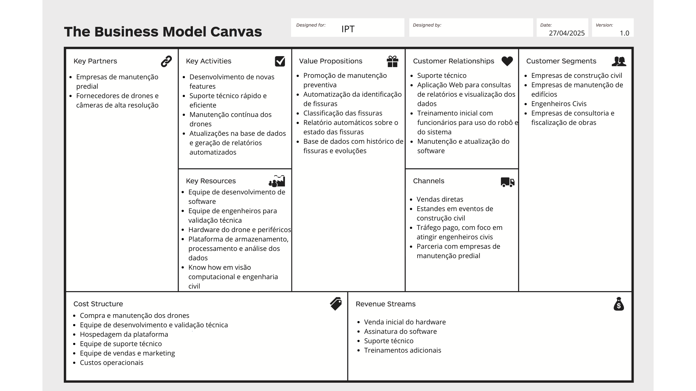

# Business Model Canvas

O **Business Model Canvas (BMC)** é uma ferramenta visual que mapeia, em um único quadro, os principais elementos que compõem um modelo de negócios. Ele ajuda a equipe a ver, de forma integrada, como a proposta de valor se conecta aos clientes, às operações e às finanças.  

Para o projeto de **inspeção automatizada de fachadas** com drones e visão computacional, elaboramos o canvas abaixo, personalizado para as necessidades do IPT e de empresas de engenharia civil.

---

## Explicação de cada bloco

### 1. **Propostas de Valor**
> **Define os benefícios que nossa solução oferece ao cliente**
- Promoção de **manutenção preventiva**, **classificação de fissuras** por grau de severidade, **automatização da identificação de fissuras** em tempo real e geração de **relatórios automáticos** com histórico evolutivo. A proposta de valor está adaptada para atender o que o cliente espera, de acordo com suas necessidade e desejo, promovendo maior velocidade, precisão e organização para quem desejar fazer a inspeção de fachadas.

### 2. **Segmentos de Clientes**
> **Define os diferentes grupos de pessoas ou organizações que a empresa visa atender**
- A solução é direcionada para **empresas de construção civil** que realizam obras de grande porte, **empresas de manutenção predial** que necessitam fazer vistorias recorrentes, **engenheiros civis** autônomos que oferecem serviços de inspeção e **empresas de consultoria e fiscalização de obras**. A proposta de valor se conecta com esses segmentos de clientes pela alta necessidade de inspeção confiável e manutenção preventiva que eles possuem.

### 3. **Canais**
> **Explica como a empresa comunica suas propostas de valor aos segmentos de clientes e como ela entrega essas propostas**
- As propostas de valor são divulgadas por meio de **demonstrações em feiras de construção civil**, campanhas de **marketing digital segmentadas a engenheiros** e empresas de manutenção, **vendas diretas** pela equipe comercial do IPT e **parcerias com prestadores de serviço predial** que incorporam nosso sistema em seus contratos de vistoria. Com isso, é buscado unir presença física (feiras) e digital para maximizar o alcance.

### 4. **Relacionamento com Clientes**
> **Define os tipos de relações que a empresa estabelece com os clientes em cada segmento**
- Manter um **suporte técnico dedicado**, de fácil comunicação e rápido atendimento, oferecer um **treinamento inicial** para uso do drone e da plataforma, disponibilizar uma **aplicação web** para consulta de relatórios e histórico de inspeções, e conduzir ciclos de **manutenção e atualização** do software para atender a novas demandas de campo. O relacionamento com os clientes será feito tanto de modo presencial quanto online, com foco em criar confiança e engajamento de longo prazo.

### 5. **Fontes de Receita**
> **Representa o dinheiro que a empresa gera de cada segmento de clientes (se e como eles estão dispostos a pagar)**
- **Venda inicial do hardware** (drone), **assinatura recorrente do software** de análise (SaaS), **contratos de suporte premium** com SLA dedicado e **serviços adicionais de treinamento** avançado e consultoria personalizada. Sendo assim, será um modelo de compra e assinatura.

### 6. **Recursos Principais**
> **São os ativos mais importantes necessários para fazer o modelo de negócio funcionar**
- Equipe de desenvolvimento de software e IA, engenheiros civis para validação técnica, drones e câmeras de alta resolução, plataforma de backend e banco de dados para armazenamento e processamento de imagens, e know-how em visão computacional e engenharia civil. São fundamentais para o sucesso da proposta de valor

### 7. **Atividades-chave**
> **As ações mais importantes que uma empresa deve fazer para que seu modelo de negócio funcione**
- Desenvolver e manter o algoritmo de detecção de fissuras, validar o sistema em campo, coletar e processar dados de inspeção, gerar relatórios automatizados, prestar suporte e realizar treinamentos periódicos aos clientes. Um ciclo ágil de atualizações de melhorias no software e atendimento ao cliente são essenciais para que o modelo de negócios funcione.

### 8. **Parcerias Principais**
> **As redes de fornecedores e parceiros que ajudam a empresa a funcionar eficientemente**
- **Fornecedores de drones e câmeras especializadas** e **empresas de manutenção predial.** Essas parcerias serão muito importantes para viabilizar os custos, ter uma quantidade confortável de estoque e promover distribuição do serviço.

### 9. **Estrutura de Custos**
> **Todos os custos incorridos para operar um modelo de negócio**
- Inclui **aquisição e manutenção dos drones**, **hospedagem e processamento na plataforma**, salários das **equipes de desenvolvimento, validação técnica e suporte**, **despesas de marketing e participação em eventos**, além de **custos logísticos** para inspeções em campo. Ter noção dos custos envolvidos de forma clara e entender a fonte de receitas é fundamental para a viabilidade financeira do negócio.

---

Este BMC sintetiza o modelo de negócio em nove blocos claros. A proposta de valor atende às demandas de manutenção preventiva e geração automática de relatórios, enquanto os segmentos de clientes — construtoras, empresas de manutenção, engenheiros e consultorias — encontram na solução eficiência e segurança. Foram definidos canais, relacionamento e fontes de receita que garantem alcance e sustentabilidade financeira. Também, há recursos principais e parcerias estratégicas para sustentar as atividades-chave, e mapeamos a estrutura de custos para planejar investimentos e escala.

:::tip
O Business Model Canvas foi construído considerando as personas envolvidas no processo atual de identificação de fissuras e as user stories criadas a partir delas. Com isso, foi possível construir uma proposta de valor para solucionar as dores desses indivíduos. 
:::
