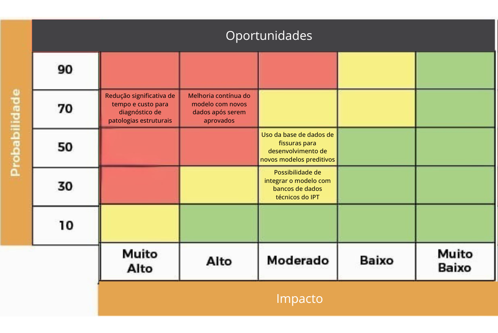

# Matriz de Riscos e Oportunidades

### Introdução

&emsp; A matriz de riscos e oportunidades é uma ferramenta essencial para a gestão estratégica de projetos, permitindo identificar, classificar e priorizar ameaças e oportunidades com base em sua probabilidade de ocorrência e impacto. 

&emsp; No contexto deste projeto – que visa o desenvolvimento de um algoritmo para detecção e monitoramento automatizado de fissuras em fachadas por meio de imagens capturadas por drones – essa análise vai nos auxíliar a previnir possíveis erros que possam afetar a solução, além de trazer alguns pontos positivos de oportunidades que podem vir junto com a solução, garantindo a viabilidade técnica e a qualidade do produto.

A seguir, apresentamos a matriz de riscos e oportunidades elaborada para este projeto.

### Figura 1 - Matriz de Riscos e Oportunidades

_Fonte: Os autores (2025)_

&emsp; A matriz acima posiciona cada item identificado de acordo com a **probabilidade** de ocorrência e o **impacto** que ele pode causar. Os quadrantes em vermelho destacam situações críticas que exigem atenção imediata, enquanto os quadrantes em verde representam pontos de baixa prioridade. Esse mapeamento orienta as ações de mitigação e aproveitamento de oportunidades ao longo do ciclo de vida do projeto.

---

## Ameaças

### 1. Inconsistência nos dados de treinamento (rotulagem incorreta das fissuras)
- **Descrição:** Dados mal anotados podem afetar a performance do modelo, gerando erros de classificação e baixa confiabilidade nos resultados.  
- **Impacto:** Muito Alto  
- **Probabilidade:** Alta (70%)

### 2. Limitações do modelo ao generalizar fissuras em diferentes tipos de revestimento
- **Descrição:** O algoritmo pode apresentar dificuldades ao identificar fissuras em revestimentos variados, o que compromete a confiabilidade da solução em cenários diversos.  
- **Impacto:** Alto  
- **Probabilidade:** Alta (70%)

### 3. Erro de classificação na análise de imagem (fissura confundida com sombra, sujeira ou textura)
- **Descrição:** A semelhança visual de outros elementos com fissuras pode prejudicar o desempenho do algoritmo.  
- **Impacto:** Muito Alto  
- **Probabilidade:** Média (50%)

### 4. Dificuldade de padronizar critérios de gravidade das fissuras entre especialistas
- **Descrição:** A ausência de consenso técnico entre engenheiros pode dificultar a classificação automatizada.  
- **Impacto:** Alto  
- **Probabilidade:** Média (50%)

### 5. Restrição de uso e distribuição por acordos de confidencialidade e controle governamental
- **Descrição:** Documentos e dados técnicos do IPT podem estar sobre regras e restriçoes governamentais, limitando integrações e possíveis usos.  
- **Impacto:** Alto  
- **Probabilidade:** Média (30%)

### 6. Interface gráfica confusa ou pouco intuitiva para os usuários finais
- **Descrição:** Caso a interface seja difícil de utilizar, isso comprometerá a adoção da solução pelos engenheiros.  
- **Impacto:**  Alto  
- **Probabilidade:** Baixa (10%)

### 7. Demora na resposta do site relacionado ao upload/envio de imagens
- **Descrição:** Lentidão no carregamento ou envio de imagens pode desestimular o uso do sistema.  
- **Impacto:** Baixo  
- **Probabilidade:** Média (50%)

## Plano de Mitigação de Riscos

&emsp; Para garantir uma prevenção eficaz, vamos apresentar estratégias que podem ser utilizadas para evitar ou mitigar as ameaças descritas acima. Cada estratégia inclui ações específicas, sua forma de implementação e propostas de acompanhamento.

### 1. Inconsistência nos dados de treinamento (rotulagem incorreta das fissuras)
**Estratégia: Implementar um processo rigoroso de validação dos dados rotulados.**

**Implementação:**
- Estabelecer um protocolo de "rotulação" com diretrizes claras;
- Envolver os especialistas na rotulgem estruturação do banco de dados, além de aplicar uma análise de concordância;

**Acompanhamento:**
- Verificações periódicas das respostas (verificar se ainda fazem sentido);
- Verificar a atualização dos dados do banco de dados.

### 2. Limitações do modelo ao generalizar fissuras em diferentes tipos de revestimento
**Estratégia: Diversificar o conjunto de dados de treinamento**

**Implementação:**
- Coleta de imagens em diferentes tipos de revestimento e condições de iluminação;
- Aplicação de técnicas como rotação, contraste e ruído para simular variações;
- Avaliação de desempenho por categoria "situação".

**Acompanhamento:**
- Métricas específicas por tipo de superfície que mostram se o modelo está dentro de uma area aceitável de acertos;
- Inclusão em um relatório feito pelos especíalistas.

### 3. Erro de classificação na análise de imagem (fissura confundida com sombra, sujeira ou textura)
**Estratégia: Refinar o modelo com foco em robustez contra ruído visual + opção de remoção de imagens ruins.**

**Implementação:**
- Adcionar opção no software de reavalição e remoção de imagens problemáticas;
- Inclusão de imagens com sombras, sujeiras e texturas no treinamento.

**Acompanhamento:**
- Inclusão em um relatório feito pelos especíalistas.

### 4. Dificuldade de padronizar critérios de gravidade das fissuras entre especialistas
**Estratégia: Construir uma "guideline" consensual entre os técnicos.**

**Implementação:**
- Envolver os especialistas na criação dos critérios de gravidade do banco de dados;
- Estabelecer um protocolo de "rotulação" com diretrizes claras.

**Acompanhamento:**
- Inclusão em um relatório feito pelos especíalistas;
- Atualização dos critérios se necessário.

### 5. Restrição de uso e distribuição por acordos de confidencialidade e controle governamental
**Estratégia: Mapear as restrições legais desde o início e aplicar políticas de compliance.**

 **Implementação:**
- Seguir a LGPD de maneira metódica;
- Consultar leis e pesquisar tudo que pode se encaixar no projeto.

**Acompanhamento:**
- Rever regras que podem ser afetadas a cada nova versão da solução.

### 6. Interface gráfica confusa ou pouco intuitiva para os usuários finais
**Estratégia: Aplicar princípios de UX/UI desde as primeiras etapas de design.**

**Implementação:**
- Realização de testes de usabilidade com técnicos (os usuários reais);
- Planejar tudo com protótipos navegáveis (ex: Figma);

**Acompanhamento:**
- Coleta de métricas de uso (cliques, tempo de tarefa);
- Formulários de satisfação e sugestões dentro da aplicação.

### 7. Demora na resposta do site relacionado ao upload/envio de imagens
**Estratégia: Otimizar processos de upload e uso de processamento.**

**Implementação:**
- Compressão de imagens no front-end sem perda crítica de qualidade;
- Exibir barra de progresso ou notificações enquanto o processamento ocorre.

**Acompanhamento:**
- Monitoramento de tempo de resposta;
- Alertas de desempenho quando os tempos excederem limites definidos.

---

## Oportunidades

### 1. Redução significativa de tempo e custo para diagnóstico de patologias estruturais
- **Descrição:** Com a automatização dos processos o tempo e o custo serão otimizados.  
- **Impacto:** Muito Alto  
- **Probabilidade:** Alta (70%)

### 2. Melhoria contínua do modelo com novos dados após serem aprovados
- **Descrição:** À medida que mais dados forem disponibilizados, o modelo pode se tornar mais preciso e robusto.  
- **Impacto:** Alto  
- **Probabilidade:** Alta (70%)

### 3. Uso da base de dados de fissuras para desenvolvimento de novos modelos preditivos
- **Descrição:** A base pode servir como referência para futuras soluções relacionadas à patologia estrutural.  
- **Impacto:** Moderado  
- **Probabilidade:** Média (50%)

### 4. Possibilidade de integrar o modelo com bancos de dados técnicos do IPT
- **Descrição:** Caso seja viável, essa integração pode enriquecer os dados e melhorar o desempenho do sistema.  
- **Impacto:** Moderado  
- **Probabilidade:** Média (30%)

---

### Considerações Finais

&emsp; A matriz de riscos e oportunidades nos permitiu antecipar desafios críticos, como limitações técnicas do modelo e a dependência de dados de qualidade, ao mesmo tempo em que revelou possibilidades de evolução contínua e uso estratégico da base de dados do IPT. Além disso, em outra nota, trouxe a nós uma nova atenção a detalhes que exigiram pesquisa e preparo, relacionados desde partes da solução a possíveis burocracias governamentais que talvez tivéssemos que acatar.

&emsp; Com essa visão estruturada, é possível orientar decisões mais assertivas, desde o desenvolvimento até a aplicação prática da solução.

&emsp; A adoção de estratégias de mitigação para os riscos mais críticos e o investimento em oportunidades de melhoria contínua serão essenciais para garantir que o produto final atenda as nessecidades nosso cliente.