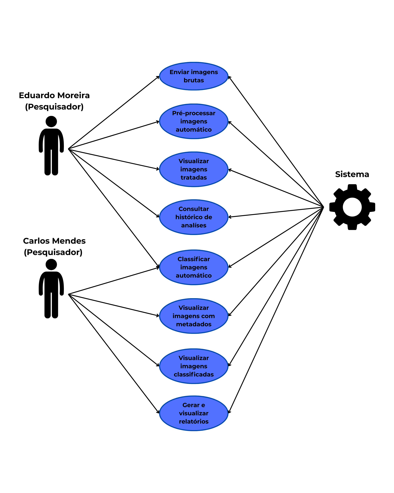

# Arquitetura da Informação

A arquitetura da informação é uma disciplina fundamental na engenharia de software, responsável por estruturar e organizar os componentes de um sistema de forma lógica e eficiente. Entre as diversas ferramentas utilizadas para essa finalidade, destacam-se os diagramas de sequência e os diagramas de contexto, que auxiliam na visualização e compreensão das interações e estruturas do sistema.

O **diagrama de sequência**, conforme definido pela Unified Modeling Language (UML), é um tipo de diagrama de interação que ilustra como e em que ordem um grupo de objetos interage. Ele é amplamente utilizado por desenvolvedores de software e profissionais de negócios para entender as necessidades de um novo sistema ou para documentar um processo existente. Esses diagramas são particularmente eficazes para representar os detalhes de um caso de uso, modelar a lógica de processos complexos e visualizar as interações entre objetos e componentes para concluir um processo.

Já o **diagrama de casos de uso** descreve, de forma estruturada, as funcionalidades que o sistema oferece sob a perspectiva dos usuários (atores). Ele representa as interações entre os atores e o sistema, evidenciando os diferentes objetivos que cada perfil de usuário busca alcançar ao utilizar o produto. Esse tipo de diagrama é essencial para o levantamento e organização dos requisitos funcionais, permitindo uma visão clara das capacidades do sistema e das expectativas dos usuários. Além disso, contribui para a priorização de funcionalidades e a validação das necessidades das personas envolvidas no projeto.

A utilização combinada do diagrama de casos de uso e do diagrama de sequência oferece uma compreensão clara das funcionalidades acessíveis a cada perfil de usuário e do caminho percorrido por eles dentro do sistema. Enquanto o diagrama de casos de uso evidencia os objetivos específicos dos usuários ao interagir com o sistema, o diagrama de sequência detalha como essas interações se desenrolam tecnicamente, passo a passo. Essa abordagem possibilita mapear com precisão as necessidades dos diferentes usuários e como o sistema responde a cada ação, promovendo um alinhamento mais eficaz entre o comportamento esperado do sistema e a experiência do usuário final.

---

## Diagrama de Casos de Uso

O diagrama de casos de uso desenvolvido contempla as duas personas principais do sistema — Eduardo e Carlos — abordando suas dores e necessidades específicas de forma estruturada. Apesar de compartilharem o interesse pela automatização da classificação de imagens, cada um possui motivações e formas distintas de interação com o sistema. Para melhor compreensão, a descrição será feita separadamente para cada persona.

A persona **Eduardo** busca principalmente otimizar seu fluxo de trabalho, que atualmente é lento e manual. Sua prioridade está na **velocidade do processamento** e no **acesso ágil às imagens classificadas**, de modo que consiga dar continuidade às pesquisas com mais eficiência. Para atender a essa demanda, o sistema permite:

1. **Enviar imagens brutas**, diretamente do cartão de memória do drone DJI Inspire 1, sem necessidade de processos manuais intermediários.
2. **Pré-processar imagens automaticamente**, reduzindo a necessidade de intervenção humana na etapa de limpeza e organização dos dados.
3. **Visualizar imagens tratadas**, com acesso rápido ao resultado do pré-processamento.
4. **Classificar imagens automaticamente**, garantindo padronização na análise e eliminação de subjetividades.
5. **Consultar histórico de análises**, possibilitando comparações, rastreabilidade e retomada de trabalhos anteriores.

Já a persona **Carlos**, embora também deseje se afastar das atividades manuais, tem como principal foco **a geração de conhecimento estruturado** a partir dos dados obtidos. Seu objetivo é produzir relatórios ricos em informação, com gráficos, estatísticas e associação entre imagens e metadados relevantes. Assim, além de se beneficiar dos mesmos recursos que Eduardo para envio, pré-processamento e classificação de imagens, Carlos faz uso de funcionalidades complementares, como:

6. **Visualizar imagens com metadados**, integrando dados como data da captura, localização, tipo de fissura, entre outros.
7. **Visualizar imagens classificadas**, acessando diretamente os resultados das análises automáticas.
8. **Gerar e visualizar relatórios**, que agregam os dados em formatos úteis para documentação técnica, apresentações e publicação de estudos.

Todos os casos de uso estão vinculados a um único ator-sistema, responsável por coordenar todo o fluxo de dados — desde a recepção das imagens até a geração de relatórios. O sistema atua como o núcleo inteligente das operações, integrando as etapas de análise e organização da informação de forma automatizada.

O diagrama de casos de uso proporciona uma visão clara das funcionalidades que o sistema oferece a cada perfil de usuário, evidenciando como ele atende às necessidades específicas das personas envolvidas. Ao contemplar desde o envio inicial das imagens até a geração de relatórios analíticos, o sistema garante eficiência, padronização e valor agregado às atividades de pesquisa realizadas no IPT. Essa estrutura funcional também contribui para a escalabilidade futura do produto, alinhando-se ao potencial de apoio a órgãos públicos e empresas.

---

## Diagramas de Sequência

Foram elaborados dois diagramas de sequência correspondentes às duas personas identificadas no projeto: Carlos Mendes e Eduardo Moreira, ambos pesquisadores do Instituto de Pesquisas Tecnológicas (IPT). As motivações e necessidades específicas de cada um estão detalhadas em outro tópico da documentação, dedicado à descrição das dores das personas.

### Pesquisador 1 — Carlos Mendes

**Situação 1**
Carlos insere o cartão de memória do drone no computador e clica no botão "Carregar Imagens" (1.0). Isso aciona uma requisição à API local (1.1), que processa automaticamente os arquivos `.jpeg` e `.jpg`, armazenando-os no banco de dados (1.2) e retornando o status da operação com os IDs das imagens cadastradas.

**Relação com as dores de Carlos Mendes**  
A etapa inicial de ingestão das imagens agora é ainda mais automatizada e eficiente. Ao eliminar etapas manuais e permitir a integração direta do cartão de memória com a aplicação, Carlos ganha velocidade na preparação do ambiente de análise, reduzindo atrasos no fluxo de trabalho.

---

**Situação 2**
Carlos clica no botão “Começar a processar imagens” na interface da aplicação (2.0). O front-end envia uma requisição para a Web API (2.1), que consulta o banco de dados em busca das imagens brutas (2.2). Essas imagens são encaminhadas para a classe `DataCleaner` do módulo de Machine Learning, que realiza o pré-processamento (2.3). As imagens limpas são armazenadas em uma tabela separada (`clean_images`) (2.4). Em seguida, a API local consulta o banco para obter essas imagens processadas e envia os dados para o front-end, permitindo que Carlos visualize os resultados do pré-processamento (2.5).

**Relação com as dores de Carlos Mendes**  
Essa etapa automatizada de pré-processamento garante que as imagens estejam padronizadas antes da classificação, o que aumenta a precisão do modelo e evita retrabalho. Ao integrar essa etapa à visualização no front-end, Carlos economiza tempo e tem maior controle sobre a qualidade das imagens usadas nas análises, otimizando o fluxo de trabalho e contribuindo para relatórios mais precisos.

---

**Situação 3**
Carlos inicia a classificação automática clicando em um botão no front-end (3.0). A requisição é encaminhada para a Web API (3.1), que busca as imagens a classificar no banco de dados (3.2). Em seguida, as imagens são processadas por um modelo de machine learning (3.3) que retorna os resultados já classificados. Os dados são então salvos em tabelas específicas de acordo com o tipo de fissura (3.4) e disponibilizados no front-end (3.5).

**Relação com as dores de Carlos Mendes**  
Com a classificação automatizada por machine learning e a estruturação dos dados em categorias específicas, Carlos obtém resultados mais rápidos, padronizados e confiáveis. Isso acelera a produção de relatórios e reduz a chance de erro humano na etapa mais crítica da análise.

---

**Situação 4**
Carlos clica na opção “Consultar históricos e análises” (4.0). O front-end aciona a API local (4.1), que consulta o banco de dados e retorna um conjunto de dados com as imagens processadas, suas classificações, data e usuário responsável (4.2). Essas informações são exibidas no front-end para facilitar a navegação histórica.

**Relação com as dores de Carlos Mendes**  
A possibilidade de acessar rapidamente o histórico completo das análises permite que Carlos valide decisões anteriores, compare evoluções e estruture seus relatórios com maior consistência e embasamento técnico, otimizando tempo e aumentando a credibilidade do trabalho.

---

### Pesquisador 2 — Eduardo Moreira

**Situação 1**   
Eduardo clica em “Ver todas as imagens capturadas pelo drone” no front-end (1.0). Essa ação aciona uma requisição `GET` para a rota `image/get`, processada pela API local (1.1), que acessa o banco de dados e retorna todas as imagens disponíveis (1.2). O front-end, então, apresenta essas imagens para o pesquisador na interface.

**Relação com as dores de Eduardo Moreira**  
Essa funcionalidade fornece um ponto de acesso centralizado ao acervo de imagens capturadas, facilitando a navegação, o monitoramento visual e a gestão dos dados brutos de forma rápida e confiável.

---

**Situação 2**  
Eduardo clica em uma das imagens exibidas (2.0). O front-end envia uma requisição `GET` à rota `image/get/{id}` (2.1). A API local consulta o banco de dados utilizando o ID da imagem (2.2) e retorna os dados relacionados, como data de captura, projeto associado e outras informações. O front-end exibe esses detalhes ao pesquisador.

**Relação com as dores de Eduardo Moreira**  
Essa interação proporciona rastreabilidade e contexto para cada imagem, o que permite a Eduardo entender melhor o histórico e a finalidade do registro, evitando erros na interpretação e organizando melhor seu fluxo de pesquisa.

---

**Situação 3**  
Eduardo clica na opção “Visualizar imagens classificadas” (3.0). O front-end envia uma requisição à rota `classified-images/get` (3.1). A API local consulta o banco de dados, obtém todas as imagens que já passaram pela etapa de classificação (3.2) e retorna essas informações. O front-end exibe os dados e imagens classificadas para o pesquisador.

**Relação com as dores de Eduardo Moreira**  
Permite que Eduardo visualize rapidamente os resultados das análises, filtrando apenas as imagens que já passaram pelo modelo de classificação, o que aumenta sua produtividade e reduz o tempo gasto em verificações manuais.

---

**Situação 4**  
Ao acessar a aba de relatórios (4.0), o front-end dispara uma requisição `GET` para a rota `report/get` (4.1). A API local realiza uma consulta no banco de dados, reunindo informações como projeto, edifício, data da imagem, entre outros metadados (4.2). Esses dados são enviados ao front-end, que os organiza em relatórios e gráficos para exibição ao pesquisador.

**Relação com as dores de Eduardo Moreira**  
A funcionalidade de relatórios automatizados ajuda Eduardo a consolidar suas análises de forma visual e padronizada, facilitando o acompanhamento histórico e a elaboração de documentos científicos ou institucionais.

---

## Referências

- **LUCIDCHART.** O que é um diagrama de sequência UML? Disponível em: [https://www.lucidchart.com/pages/pt/o-que-e-diagrama-de-sequencia-uml](https://www.lucidchart.com/pages/pt/o-que-e-diagrama-de-sequencia-uml). Acesso em: 28 abr. 2025. ([O que é um diagrama de sequência UML? | Lucidchart](https://www.lucidchart.com/pages/pt/o-que-e-diagrama-de-sequencia-uml))

- **VENNGAGE.** Diagrama de contexto: o que é, exemplos e como fazer. Disponível em: [https://pt.venngage.com/blog/diagrama-de-contexto/](https://pt.venngage.com/blog/diagrama-de-contexto/). Acesso em: 28 abr. 2025. ([ANÁLISE E PROJETO DE SISTEMA DA INFORMAÇÃO AVA 2](https://www.passeidireto.com/arquivo/151087426/analise-e-projeto-de-sistema-da-informacao-ava-2))

