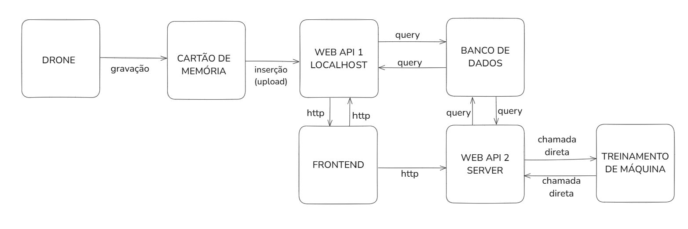

# Proposta Inicial da Arquitetura

Essa seção apresenta a proposta inicial da arquitetura do sistema idealizada pelo grupo. É importante ressaltar que, por ser inicial, essa arquitetura está sujeita a mudanças ao longo do tempo em que esse projeto estará em desenvolvimento.

Realizar a arquitetura de um sistema significa destrinchar o que será oferecido como solução em diferentes módulos, com o intuito de facilitar a compreensão de como o sistema deverá ser construído e de como ele se integra e se comunica. Para a elaboração de uma arquitetura eficiente, é necessário entender com clareza as necessidades do usuário e as regras de negócio. Portanto, foi realizada também uma análise profunda sobre quem é o usuário final do sistema, bem como uma análise do negócio (ver seções anteriores).

A seguir, com base nas análises e atenção às restrições e regras que devem ser atendidas, está a primeira versão da arquitetura do sistema que a equipe elaborou:

A arquitetura do sistema funciona como um esqueleto que evidencia os principais componentes e suas relações. Esses componentes podem ser chamados de módulos, que são essas “caixas” que podem ser vistas na imagem acima. Nesse momento, a arquitetura está dividida em sete módulos distintos:

#### Drone

- Responsável pela captura de imagens das fachadas. As imagens são salvas automaticamente no cartão de memória que está acoplado ao dispositivo.

#### Cartão de Memória

- Meio físico de armazenamento das imagens capturadas. Posteriormente, os dados são extraídos e inseridos no sistema local via Web API 1.

#### Web API 1 (Localhost)

- Sistema local responsável por receber os dados do cartão de memória, inseri-los no banco de dados e exibir as informações no frontend da aplicação.

#### Banco de Dados

- Armazena as imagens, metadados e os resultados processados.
- É acessado por ambas as APIs (1 e 2) para realizar queries de leitura e escrita.

#### Frontend

- Interface gráfica acessada pelos usuários.
- Permite visualizar os dados, interagir com os resultados e acionar APIs para requisições específicas.

#### Server Web API 2

- Responsável pelo processamento mais pesado, incluindo integração com o modelo de machine learning e comunicação com o frontend;
- Envia e recebe dados do banco de dados e do módulo de treinamento de máquina.

#### Treinamento de Máquina

- Módulo onde os modelos de machine learning são executados para classificar imagens com base em dados recebidos.
- Também pode ser re-treinado sob demanda a partir de correções feitas por especialistas.

---

A comunicação entre os módulos do sistema foi construída para garantir o fluxo contínuo de dados, desde a captura de imagens no drone até a visualização e validação dos resultados. Abaixo estão descritas as interfaces de comunicação e métodos de integração entre os principais componentes:

#### Drone → Cartão de Memória

- **Interface:** escrita direta em sistema de arquivo; protocolo interno do firmware do drone.
- **Método de Integração:** as imagens capturadas pelo drone são salvas automaticamente no cartão de memória. 

#### Cartão de Memória → Web API 1 (Localhost, no computador do operador)

- **Interface:** Acesso via sistema de arquivo local (ex: USB) ou adaptadores + HTTP (REST).
- **Método de Integração:** O operador acessa o cartão inserido fisicamente no computador e, via frontend local, faz o upload das imagens para a Web API 1 que já está rodando nessa mesma máquina. A API organiza e valida os arquivos, armazenando-os no banco de dados.

#### Web API 1 ↔ Banco de Dados

- **Interface:** SQL (ex: SQLAlchemy)
- **Método de Integração:** Web API 1 insere os dados enviados via upload, consulta os resultados de classificação já processados (gravados pela API 2) e responde às requisições do frontend. São armazenadas informações como ID da imagem, data, hora e coordenadas. 

#### Banco de Dados ↔ Web API 2 (Servidor)

- **Interface:** SQL (ex: Entity Framework Core)
- **Método de Integração:** A  Web API 2 consulta o banco de dados para obter imagens não processadas, envia para o modelo de machine learning e grava os resultados de volta (ex: tipo de fissura, acurácia da predição).

#### Web API 2 ↔ Módulo de Treinamento de Máquina

- **Interface:** Chamada direta de função no backend (invocação interna do modelo)
- **Método de Integração:** O código do modelo de machine learning está incorporado à Web API 2. Quando uma requisição é feita, a API executa diretamente o pré-processamento e a classificação dentro do próprio controller. Os resultados gerados são salvos no banco de dados. O módulo também pode ser reexecutado sob demanda, permitindo reclassificações ou re-treinamento com dados corrigidos.

#### Frontend ↔ Web API 1

- **Interface:** HTTP (ex: REST); troca de dados em JSON
- **Método de Integração:** A interface gráfica se comunica com a Web API 1 para visualizar imagens e classificações existentes, editar manualmente os resultados, consultar histórico e localização e fazer upload de novas imagens.

#### Frontend → Web API 2

- **Interface:** HTTP (ex: REST); dados em JSON
- **Método de Integração:** O usuário aciona a classificação automática pelo frontend, que envia uma requisição diretamente à Web API 2. Esta API consulta o banco de dados, executa o pré-processamento e a inferência, e grava os resultados no banco. O frontend não recebe resposta direta da API 2.

---

### Alinhamento da Arquitetura com os Requisitos do Projeto

Essa arquitetura foi estruturada para atender aos requisitos funcionais e não funcionais definidos para o projeto, priorizando processamento eficiente e facilidade de uso por parte dos usuários do IPT. A separação entre módulos e o uso de APIs independentes garantem que cada parte esteja otimizada para sua função.

A separação entre Web API 1 (local) e Web API 2 (processamento remoto), foi feita com base na necessidade de processamento leve e rápido no momento da coleta. A API local se concentra na estruturação dos dados, garantindo que as imagens sejam armazenadas com integridade (RF 10), enquanto a API 2 executa a classificação automática (RF 02), levando em consideração os requisitos de desempenho (RNF 01, 02, 03 e 04).

A decisão de manter o uso do cartão de memória reflete a prática atual dos profissionais do IPT e atende ao requisito de upload de imagens capturadas por drones ou câmeras (RF 01). Essa solução garante flexibilidade na coleta de dados em campo, mesmo em locais onde não há conectividade imediata. Posteriormente, com o cartão inserido no computador com acesso à rede, as imagens são enviadas à Web API 1 e armazenadas no banco de dados.

O banco de dados realiza o armazenamento estruturado das imagens, metadados e resultados. Ele suporta funcionalidades como histórico de análises e dados de geolocalização (RF 05, RF 07, RF 09).

A interface gráfica foi criada para funcionar localmente (RF 11), permitindo que usuários visualizem a imagem original (RF 03), validem e corrijam a classificação (RF 04) e acompanhem os agrupamentos e histórico (RF 08, 09).

O módulo de treinamento de máquina permite realizar o pré-processamento e a classificação automática das imagens em tipos distintos de fissuras (RF 02, RNF 01).

A comunicação entre APIs e frontend será via HTTP, permitindo a interoperabilidade com ferramentas existentes e atendendo às exigências de segurança.

---

A arquitetura proposta reflete as necessidades do usuário e os requisitos do sistema, garantindo modularidade, desempenho e coerência com o fluxo real de uso. A definição dos módulos e das interações considerou os métodos de captura e processamento de dados, estruturando interfaces baseadas em protocolos compatíveis com cada etapa do processo.

Como proposta inicial, essa arquitetura oferece uma base sólida para a criação do sistema, mantendo abertura e liberdade para futuras adaptações à medida que o projeto evolui.
