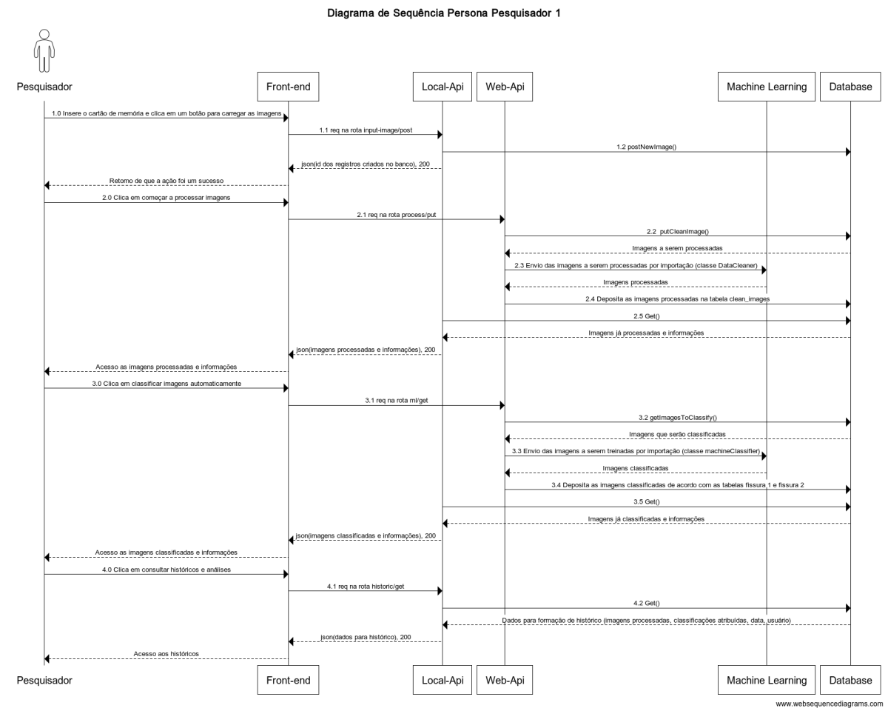
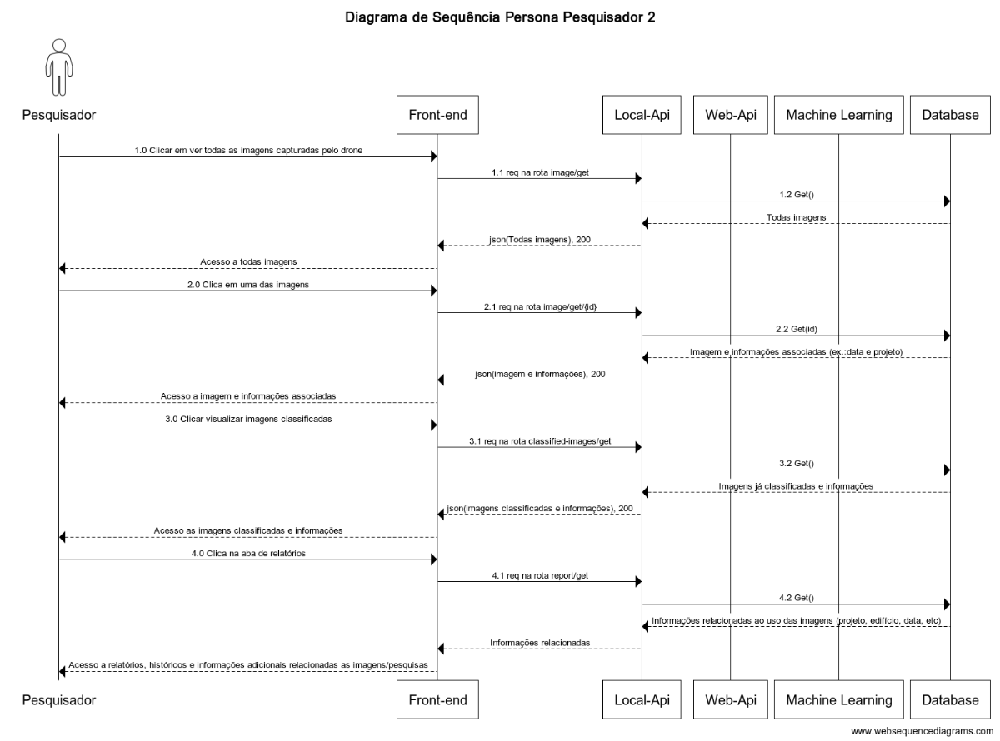

# Arquitetura da informação

A arquitetura da informação é uma disciplina fundamental na engenharia de software, responsável por estruturar e organizar os componentes de um sistema de forma lógica e eficiente. Entre as diversas ferramentas utilizadas para essa finalidade, destacam-se os diagramas de sequência e os diagramas de classes, que auxiliam na visualização e compreensão das interações e estruturas do sistema.

O **diagrama de sequência**, conforme definido pela Unified Modeling Language (UML), é um tipo de diagrama de interação que ilustra como e em que ordem um grupo de objetos interage. Ele é amplamente utilizado por desenvolvedores de software e profissionais de negócios para entender as necessidades de um novo sistema ou para documentar um processo existente. Esses diagramas são particularmente eficazes para representar os detalhes de um caso de uso, modelar a lógica de processos complexos e visualizar as interações entre objetos e componentes para concluir um processo .

Já o **diagrama de classes** é uma representação da estrutura e das relações das classes que servem de modelo para objetos em programação orientada a objetos. Ele permite visualizar as classes do sistema, seus atributos, métodos e os relacionamentos entre elas, como herança, associação e composição. Esse tipo de diagrama é essencial para compreender a estrutura estática do sistema e serve como base para a implementação do código . 

A utilização conjunta desses diagramas proporciona uma visão abrangente do sistema, permitindo tanto a análise de suas interações dinâmicas quanto de sua estrutura estática. Essa abordagem facilita a comunicação entre os membros da equipe de desenvolvimento e contribui para a criação de sistemas mais robustos e bem estruturados.

---

## Diagramas de Sequência

Foram elaborados dois diagramas de sequência correspondentes às duas personas identificadas no projeto: Carlos Mendes e Eduardo Moreira, ambos pesquisadores do Instituto de Pesquisas Tecnológicas (IPT). As motivações e necessidades específicas de cada um estão detalhadas em outro tópico da documentação, dedicado à descrição das dores das personas.

---

### Pesquisador 1 — Carlos Mendes

**Situação 1**  
O pesquisador retira o cartão de memória do drone DJI Inspire 1 (utilizado pelo IPT) e o insere em seu computador pessoal, que possui uma API local integrada a um front-end e a um banco de dados hospedado na nuvem. Ao clicar no botão "Enviar Imagens" (1.0), é acionada a rota `input-image/post` da API (1.1). Essa rota executa um processo automatizado que verifica o cartão e insere no banco os arquivos nos formatos `.jpeg` e `.jpg` (1.2). Ao final da operação, um feedback é retornado ao usuário com o status da ação.

**Situação 2**  
Ao iniciar o processo de classificação das imagens (2.0), o front-end realiza uma requisição HTTP para a Web API (2.1), contendo os identificadores das imagens a serem processadas. A API local consulta o banco de dados em busca das imagens correspondentes (2.2) e, em seguida, as encaminha para o modelo de machine learning previamente treinado (2.3). As imagens são classificadas automaticamente e atualizadas no banco conforme suas categorias (2.4). Por fim, a API local realiza uma requisição do tipo GET para recuperar as imagens já classificadas (2.5), que são então exibidas ao usuário no front-end.

---

### Pesquisador 2 — Eduardo Moreira

**Situação 1**  
Ao selecionar a opção "Ver todas as imagens" no front-end (1.0), é realizada uma requisição GET para a rota `image/get` (1.1). Essa solicitação ativa a API local (1.2), que acessa o banco de dados e retorna todas as imagens disponíveis para visualização na interface.

**Situação 2**  
Ao clicar em uma imagem específica na interface (2.0), uma requisição é enviada à rota `image/get/{id}` com o identificador correspondente (2.1). A API recupera a imagem solicitada e seus metadados — como informações do edifício, data da captura, nome da pesquisa e estágio atual do processamento (2.2) — retornando esses dados ao usuário.

**Situação 3**  
Quando o pesquisador opta por iniciar o tratamento das imagens (3.0), é enviada uma requisição PUT para a rota `process/put` (3.1), contendo os identificadores das imagens a serem processadas. A Web API localiza essas imagens no banco (3.2) e as encaminha ao módulo de Machine Learning (3.3). Após o processamento, as imagens tratadas são armazenadas na tabela `clean_images` do banco de dados (3.4). A API local então retorna os dados atualizados, permitindo que o front-end exiba as imagens processadas ao usuário (3.5).

**Situação 4**  
Ao acessar a aba de relatórios no front-end (4.0), é disparada uma requisição GET para a rota `report/get` (4.1). A API realiza uma consulta combinada entre as imagens e seus respectivos dados de pesquisa (4.2), gerando gráficos, estatísticas e históricos, os quais são apresentados ao usuário na interface.

---

## Referências

- **LUCIDCHART.** O que é um diagrama de sequência UML? Disponível em: [https://www.lucidchart.com/pages/pt/o-que-e-diagrama-de-sequencia-uml](https://www.lucidchart.com/pages/pt/o-que-e-diagrama-de-sequencia-uml). Acesso em: 28 abr. 2025. ([O que é um diagrama de sequência UML? | Lucidchart](https://www.lucidchart.com/pages/pt/o-que-e-diagrama-de-sequencia-uml))

- **DEVMEDIA.** Orientações básicas na elaboração de um diagrama de classes. Disponível em: [https://www.devmedia.com.br/orientacoes-basicas-na-elaboracao-de-um-diagrama-de-classes/37224](https://www.devmedia.com.br/orientacoes-basicas-na-elaboracao-de-um-diagrama-de-classes/37224). Acesso em: 28 abr. 2025. ([ANÁLISE E PROJETO DE SISTEMA DA INFORMAÇÃO AVA 2](https://www.passeidireto.com/arquivo/151087426/analise-e-projeto-de-sistema-da-informacao-ava-2))

