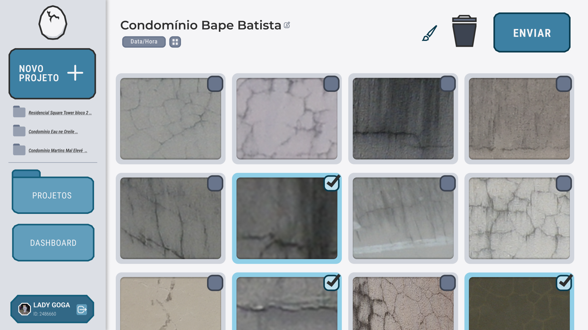
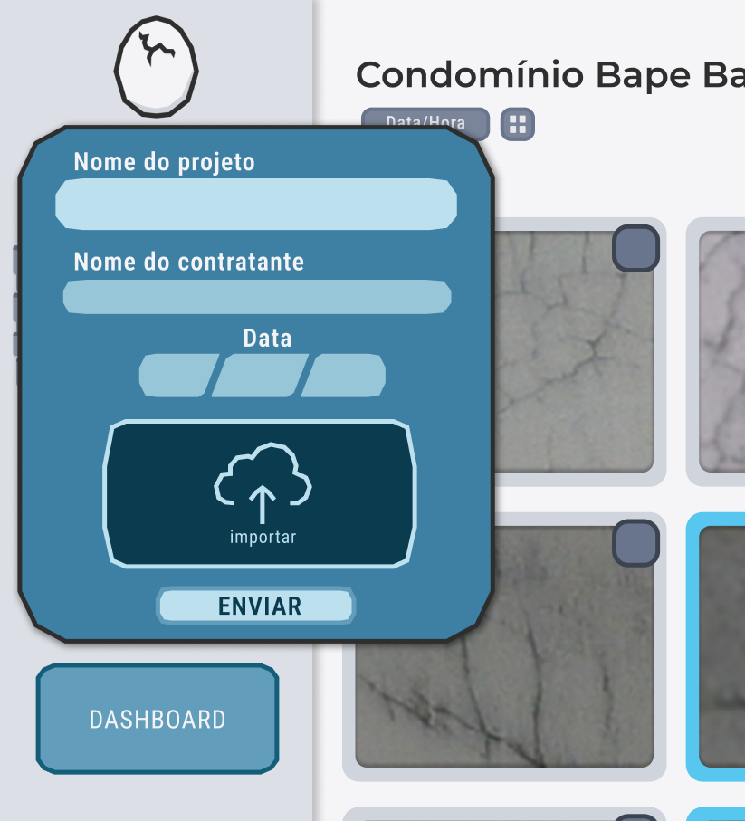

### Documentação do esboço do protótipo de alta fidelidade

Nessa sprint ainda não foi finalizado o protótipo a ser seguido pelo front-end, mas foi criado um esboço para guiar a primeira versão do website.

## Primeira Tela (Alta Fidelidade)

  
_Fonte: Os autores (2025)_

Esta tela representa o painel inicial de interação do usuário com a aplicação, onde é possível:

- Criar um novo projeto.
- Visualizar as imagens vinculadas ao projeto atual.
- Acessar outros projetos.
- Navegar entre as seções **Dashboard** e **Projetos**.
- Selecionar múltiplas imagens e enviá-las.
- Identificar e trocar o usuário logado.

### Pontos positivos

- **Ícones e botões ilustrativos:** Ajudam na compreensão sem depender excessivamente de texto.
- **Identidade visual consistente:** O estilo gráfico é marcante e mantém uniformidade.
- **Feedback visual de seleção de imagens:** Mostra de forma clara quais imagens estão selecionadas para envio.

---

## Menu de Criação de Novo Projeto

  
_Fonte: Os autores (2025)_

Este menu surge ao clicar em "Novo Projeto", permitindo **por enquanto** o preenchimento dos seguintes campos:

- Nome do projeto
- Nome do contratante
- Data
- Botão para importar as imagens
- Botão de envio

### Ponto positivo

- **Estética coesa com o restante da aplicação:** Mantém o mesmo estilo visual da interface principal

---

## Pontos a melhorar

- Contraste entre texto e fundo é baixo em alguns pontos (ex: ENVIAR, campos de input), dificultando a leitura.

- Botões e campos com contornos muito sutis podem prejudicar a usabilidade para usuários com deficiência visual ou em ambientes de baixa iluminação.

- Os elementos têm bordas ornamentadas que competem visualmente com os dados além de trazerem um visual lúdico que não é adequado para um ambiente de trabalho — isso pode gerar distração e descontentamento.

- Campos de data pouco intuitivos: não está claro se o preenchimento é manual ou por seleção.

- Botão de "importar" ocupa muito espaço e o ícone pode ser confuso — poderia ser substituído por um botão menor com legenda mais clara, como “Adicionar fotos do projeto” (Isso será organizado junto a proposta de adicionar capacidade de criação de subprojetos).

- O layout foi para telas grandes. É importante validar como ele se comporta em laptops menores.

- Muitos elementos são fixos e grandes (ex: botões laterais), o que pode reduzir o espaço útil nas telas menores além de talvez aumentar o "ar" lúdico.

- O botão de "Novo Projeto" abre um menu que sobrepõe o botão de projetos — isso pode atrapalhar usuários que já estejam interagindo com outro projeto.

- O ar do website está muito lúdico, com uma aparência meio "playfull" que não encaixa com a proposta do projeto.

---

### Providências

Neste módulo mesmo já começamos a tomar previdências para a gestão e melhora do design do website, como a inserção de uma cor nova na paleta de cores, que será usada para destaques e detalhes. Também já existe um plano de subistituição para o menu de criação de novo projeto.

## Conclusão

Este protótipo de alta fidelidade estabeleceu uma base sólida para o desenvolvimento da primeira interface de front-end navegável, com uma identidade visual concisa e boas práticas de agrupamento funcional. No entanto, **há espaço para melhorias significativas** na usabilidade, clareza de interação e ergonomia do sistema, especialmente considerando o uso frequente por funcionários em um ambiente profissional.
