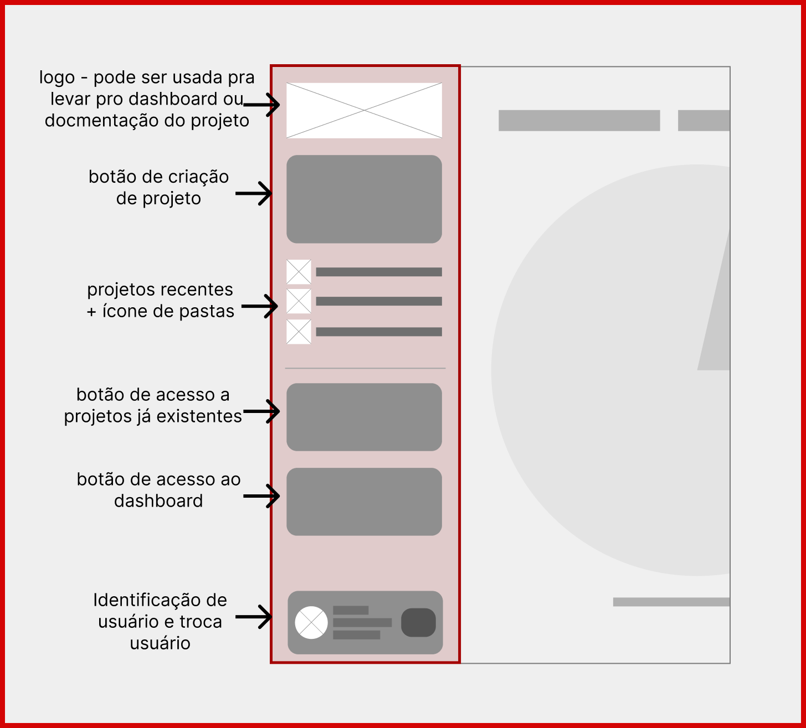
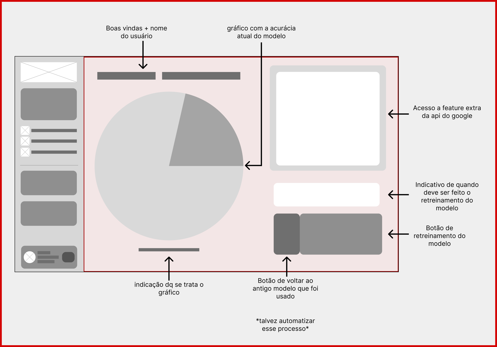
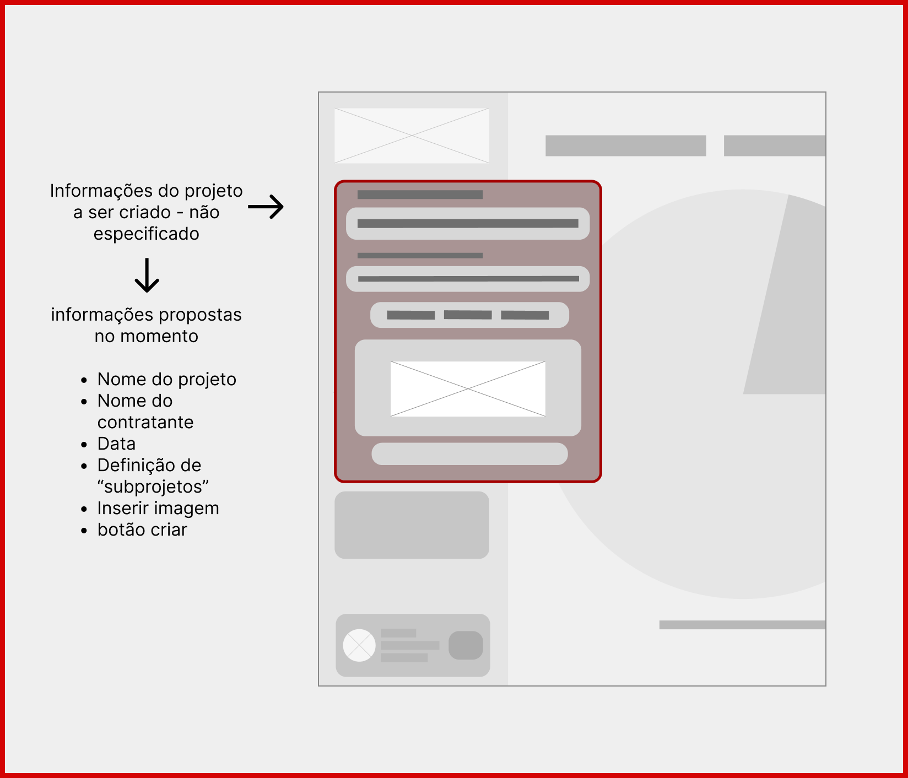
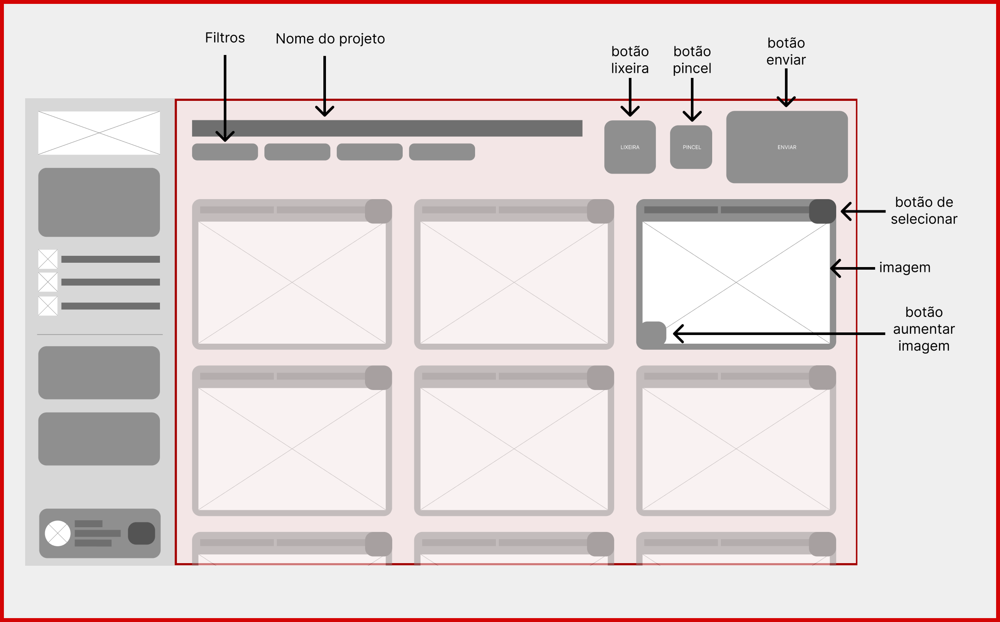
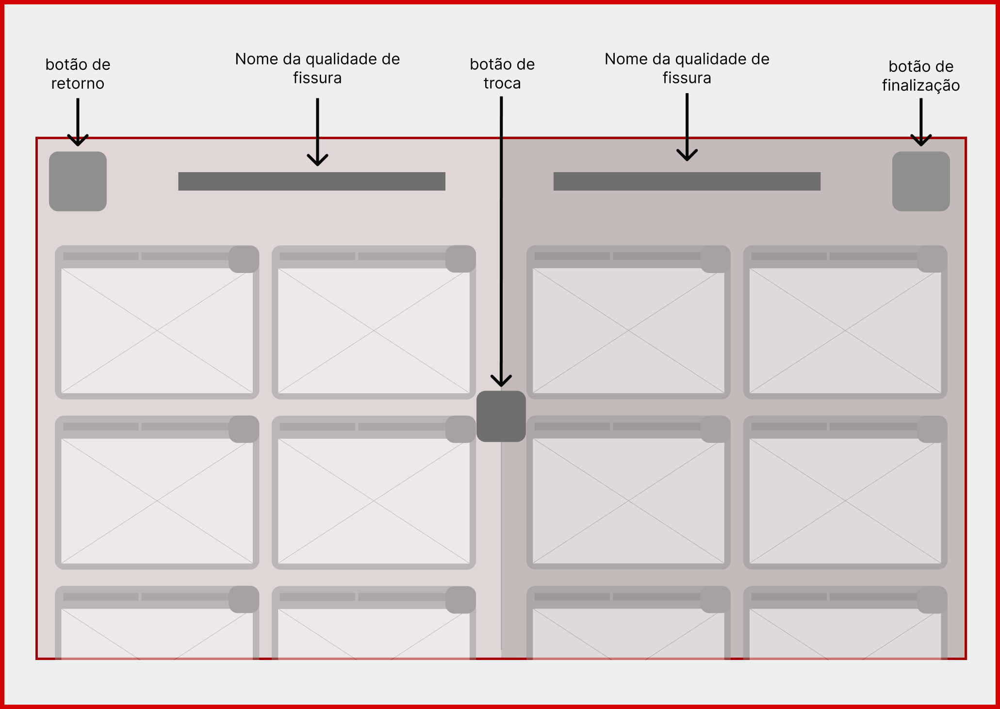

### Documentação de Protótipo de Baixa Fidelidade

**! É altamente indicado que, para uma compreensão facilitada, a documentação do user flow seja vista primeiro !**

---

### Legenda de Anotações

- **Bordas vermelhas:** área de foco que vai ser comentada
- **Setas pretas:** direcionam as legendas aos componentes que elas comentam
- **Textos em negrito:** descrição do elemnto 

---

## O que é um Protótipo de Baixa Fidelidade?

Um protótipo de baixa fidelidade (low‑fi) é uma representação simplificada da interface, geralmente em tons de cinza ou com blocos básicos, que serve para:

- Validar a **estrutura** e **navegação** antes de investir em design visual  
- Recolher **feedback rápido** sobre fluxo e disposição de elementos  
- Economizar tempo em iterações iniciais, focando em **usabilidade** e **arquitetura de informação**

---

## Objetivo destes Protótipos

- Definir todos os componentes que serão adicionados capacitando o encaminhamento do back-end e front-end (além de delinear componentes essenciais e componentes adicionais);
- Garantir que todos os componentes essenciais estejam posicionados de forma lógica e clara; 
- Testar navegação e interações-chave sem distrações de cores ou estilo visual;
- Servir de base para a construção do protótipo de alta fidelidade e do front-end;

---

### Ideação desse protótipo

O design do website e suas funcionalidades foram pensados para lembrar os aplicativos já ultilizado pelos nosso usuários, como objetivo é trazer facilidade e melhora no fluxo de trabalho deles, foi decidido que tudo deveria ser o mais pontual possível. Considerando a variedade de idades que ultilizarão o projeto algo universalmente intuitivo é necessário.

Esses princípios também estão sendo aplicados na criação do plano de claridade da "User Experience".

---

## Telas de Baixa Fidelidade

### 1. Sidebar de Navegação

  
*Fonte: Autores (2025)*

**Descrição:**  
Barra lateral fixa presente em todas as telas, agrupando as principais seções do sistema.

**Componentes:**  
- **Logotipo** (topo): leva ao **Dashboard** ou documentação interna  
- **Botão “Novo Projeto”**: abre o ""menu" de criação  
- **Projetos Recentes**: lista de atalho para últimos projetos  
- **Botão “Projetos”**: abre tela de listagem completa  
- **Botão “Dashboard”**: retorna à visão geral  
- **Perfil do Usuário**: mostra e troca conta ativa  

---

### 2. Tela de Dashboard

  
*Fonte: Autores (2025)*

**Descrição:**  
Tela com informações úteis sobre o modelo e projetos. Também é a "welcome screen" até o momento.

**Componentes:**  
- **Saudação + Nome do Usuário**  
- **Gráfico de Acurácia**: mostra performance atual do modelo  
- **Quadro de Ação Extra (API Google)**: espaço reservado para integrações futuras  
- **Indicativo de Retreinamento**: alerta se modelo pode ser atualizado  
- **Botão “Retreinar Modelo”**: inicia processo de retraining  
- **Botão “Voltar ao Modelo Anterior”**: restaura versão prévia do modelo  

**Interações esperadas:**  
- Hover em gráfico exibe tooltip com valores  
- Clique em “Retreinar” exibe modal de confirmação  

---

### 3. "Menu" de Criação de Projeto

  
*Fonte: Autores (2025)*

**Descrição:**  
"Menu" pop-up para inserção de metadados e imagens ao criar um novo projeto.

**Componentes não finais:** 
 
- **Campo “Nome do Projeto”** (input de texto)  
- **Campo “Contratante”** (input de texto)  
- **Seleção de Data** (date picker)  
- **Definição de Subprojetos** (tags ou checklist)  
- **Upload de Imagens** (dropzone)  
- **Botão “Criar”** (confirma ação)  

---

### 4. Tela de Projeto (Listagem de Imagens)

  
*Fonte: Autores (2025)*

**Descrição:**  
Área central onde o usuário visualiza as imagens do projeto e aciona ações como editar, deletar e enviar.

**Componentes:**  
- **Filtros Rápidos**: botões para filtrar por data, categoria, etc  
- **Título do Projeto** (cabeçalho)  
- **Botões de Ação**:  
  - **Lixeira** (excluir imagens selecionadas)  
  - **Pincel** (editar imagens selecionadas)  
  - **Enviar** (avançar para veredito)  
- **Grid de Cartões de Imagem**: cada cartão exibe:  
  - Thumbnail da foto  
  - Botão “Selecionar” (checkbox)  
  - Botão “Aumentar Imagem” (zoom)  

---

### 5. Tela de Veredito

  
*Fonte: Autores (2025)*

**Descrição:**  
Etapa final de classificação, onde o usuário da o veredito sob as imagens já classificadas pelo modelo.

**Componentes:**  
- **Botão “Voltar”**: retorna à listagem sem salvar alterações  
- **Título da Categoria** (ex.: “Fissura Térmica”)  
- **Grid de Imagens categorizadas**: por tipo de fissura 
- **Botão “Troca Categoria”** Muda as fotos selecionadas para o outro campo  
- **Botão “Finalizar”**: confirma classificação e encerra fluxo  

---

## Considerações Finais

Os protótipos de baixa fidelidade documentados acima focam em validar a **arquitetura de informação** e o **fluxo de navegação**, sem foco em estilo visual ou branding. Eles devem ser usados como base de testes de usabilidade iniciais e servir de apoio para a criação do protótipo de alta fidelidade.

---

## Referências

- FIGMA. *Prototipagem de baixa fidelidade: o que é e como pode ajudar?*. Disponível em: https://www.figma.com/resource-library/low-fidelity-prototyping/. Acesso em: 16 maio 2025.
