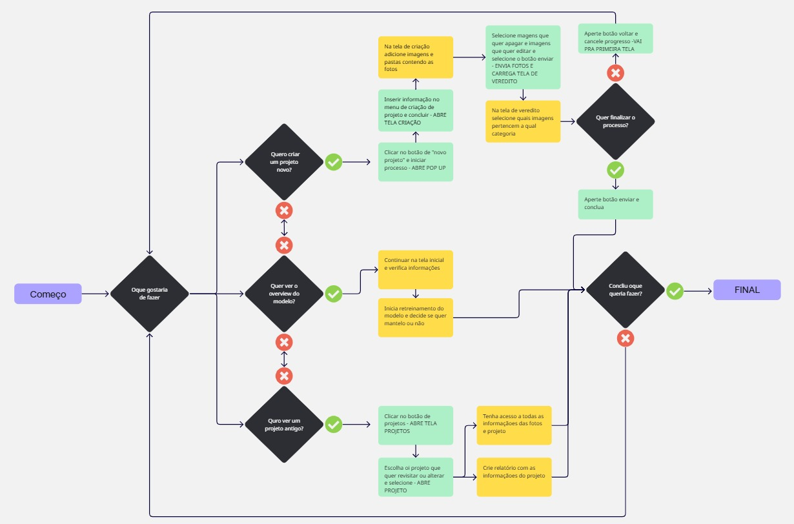

## Documentação do User flow

_Fonte: Os autores (2025)_

[Ver PDF para melhor vizualização](../../../static/img/design/userflow.pdf)

**Legenda:**

* Preto: Representa uma escolha/pergunta que corresponde a intenção do usuário ao ultilizar o programa.

* Amarelo: Ação que não muda a tela que está sendo ultilizada.

* Azul: Ação que muda a tela que está sendo ultilizada.

* Símbolo de sim: Representa a resposta **positiva** da pergunta retórica feita na caixinha preta.

* Símbolo de não: Representa a resposta **negativa** da pergunta retórica feita na caixinha preta.

### **Oque é um User Flow?**

Um User Flow (ou fluxo do usuário) é um diagrama que representa o caminho percorrido por um usuário dentro de um sistema digital, desde o ponto de entrada até a conclusão de uma tarefa específica. Ele ajuda a visualizar a lógica de navegação, as tomadas de decisão e os possíveis pontos de retorno ou abandono.

Essa ferramenta é essencial no processo de design de produtos digitais (ou não!), pois:

* Garante que a navegação seja fluida e intuitiva;

* Reduz a chance de frustrações por parte do usuário;

* Auxilia desenvolvedores e designers a entenderem o comportamento esperado dentro da aplicação;

* Serve como base para testes de usabilidade e estruturação de telas.

### Objetivo do User Flow neste projeto

O user flow deste projeto foi desenvolvido com o objetivo de mapear a experiência do usuário ao interagir com a plataforma de classificação e gerencia de projetos, que envolve etapas como criação de novos projetos, visualização de modelos e acesso a projetos anteriores.

A ideia é garantir que qualquer pessoa, independentemente de familiaridade prévia com o sistema, consiga executar suas ações com clareza e agilidade.

---

### Visão geral do fluxo

O fluxo se inicia na tela do dashboard, onde dependendo da necessidade do usuário ele pode escolher 3 caminhos:

#### 1. Criar um novo projeto
Se o usuário deseja iniciar um novo projeto:

Ele clica no botão "Novo projeto", que abre um pop-up de criação.

Em seguida, preenche as informações solicitadas e é direcionado à tela onde acontecerá a criação de subprojetos e inserção das imagens (Essa tela em específico ainda não existe, pois foi uma necessidade nova do parceiro que só foi verificiada no ultimo encontro dia 16/05).

O usuário seleciona as imagens e pastas desejadas e as envia ao sistema.

Faz a seleção de que imagens que manter e que imagens que editar no projeto.

Após isso, o sistema carrega a tela de veredito, onde o usuário deve verificar a classificação das imagens por categoria.

Se o usuário quiser finalizar esse processo ele deve então clicar em “Enviar” e finalizar.

Se por algum motivo durante o processo de vereditoele quiser encerrar a ação, ele pode voltar e cancelar o progresso, retornando à tela inicial.

#### 2. Ver o dashboard do site
Se o usuário deseja verificar informações extras ou performance do modelo atual/data de retreinamento:

Permanece na tela inicial e recebe os dados da acuracia atual do modelo.

Caso deseje, pode iniciar o re-treinamento do modelo, pode se basear na indição de "se ele dever ser atualizado ou não".

Decide se quer manter o modelo treinado ou voltar ao antigo.

#### 3. Acessar um projeto antigo
Se o usuário deseja consultar ou editar um projeto anterior:

Ele acessa o botão “Projetos”, que abre a tela de projetos existentes.

Escolhe o projeto que deseja visualizar → sistema abre o projeto.

Tem acesso a todas as informações detalhadas do projeto e das fotos utilizadas.

*Pode gerar relatórios com os dados disponíveis (Ainda não definitivo, mas discutido na reunião com o parceiro que foi realizada dia 16/05).*

#### Encerramento do fluxo

Ao concluir qualquer um dos 3 caminhos, o usuário tem a opção escolher realizar outro caminho, ou sair do site, concluindo seu uso.

---

## Considerações finais

Esse user flow foi desenhado pensando na simplicidade da navegação. Um ponto importante no julgamento de um user flow é verificar se as ações são eficientes (levam o usuário ao objetivo de maneira rápida) e podem ser feitas com certo minimalismo (os caminhos evitam informações redundantes e etapas desnecessárias), e acredita-se que isso foi concretizado nessa parte do projeto. Cada decisão é clara, e há sempre a opção de voltar atrás, o que reforça a usabilidade e a acessibilidade do sistema. Ele também fornece um ponto de partida importante para a prototipagem de telas e construção de wireframes coerentes com as necessidades reais de quem vai usar a plataforma.

---

### Referências

* FIGMA. User flow: o que é, por que importa e como criá-lo. Disponível em: https://www-figma-com.translate.goog/resource-library/user-flow. Acesso em: 10 maio 2025.
