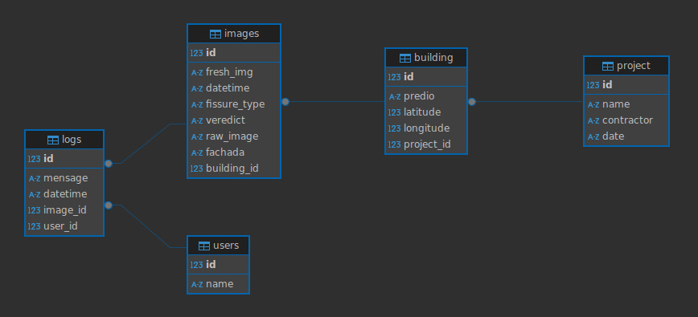

# Documentação do Banco de Dados

## 1. Introdução

Essa seção descreve a modelagem e estrutura do banco de dados utilizado para o gerenciamento dos projetos, imagens, usuários e logs da aplicação. O banco de dados foi implementado utilizando PostgreSQL e está hospedado no Render, enquanto o armazenamento de imagens é gerenciado pelo Cloudinary. A seguir, são apresentados detalhes sobre a modelagem relacional, as tabelas, atributos e suas conexões.

### 1.1. Render
Render é um serviço de hospedagem que oferece suporte completo para aplicações web, incluindo bancos de dados. Neste projeto, ele é utilizado para manter a base de dados em PostgreSQL de forma escalável, segura e com alta disponibilidade.

### 1.2. Cloudinary
Cloudinary é um serviço especializado em gerenciamento de mídia, oferecendo otimização e entrega rápida de imagens. Neste projeto, ele armazena as imagens capturadas e processadas, disponibilizando URLs para acesso rápido e integrado às rotas da API.

---

## 2. Modelagem Relacional

Abaixo, é possível visualizar a modelagem relacional do banco de dados:

---

## 3. Estrutura das Tabelas
### 3.1 Tabela: **users**
| Atributo | Tipo       | Descrição                               |
|-----------|------------|----------------------------------------|
| `id`        | Integer   | Identificador único do usuário          |
| `name`      | String    | Nome do usuário                         |

A tabela `users` representa os usuários do sistema. Cada usuário possui um identificador único e um nome.

---

### 3.2 Tabela: **project**
| Atributo   | Tipo       | Descrição                                 |
|-------------|------------|------------------------------------------|
| `id`          | Integer   | Identificador único do projeto            |
| `name`        | String    | Nome do projeto                           |
| `contractor`  | String    | Nome do contratante                       |
| `date`        | String    | Data de criação do projeto                |

A tabela `project` armazena os projetos cadastrados no sistema. Cada projeto está relacionado com vários prédios (relação 1:N).

---

### 3.3 Tabela: **building**
| Atributo   | Tipo       | Descrição                                 |
|-------------|------------|------------------------------------------|
| `id`            | Integer   | Identificador único do prédio         |
| `predio`        | String    | Nome do prédio                        |
| `latitude`      | Integer    | Latitude do prédio                    |
| `longitude`     | Integer    | Longitude do prédio                            |
| `project_id`    | Integer   | Chave estrangeira para o projeto relacionado |

A tabela `building` armazena os prédios cadastrados no sistema. Cada prédio está relacionado com várias imagens (relação 1:N).

---

### 3.4 Tabela: **images**
| Atributo      | Tipo       | Descrição                                    |
|----------------|------------|--------------------------------------------|
| `id`            | Integer    | Identificador único da imagem               |
| `raw_image`     | String     | URL da imagem original armazenada no Cloudinary |
| `fresh_img`     | String     | URL da imagem processada                    |
| `datetime`      | String     | Data e hora de captura da imagem            |
| `latitude`      | Numeric    | Latitude de onde a imagem foi capturada     |
| `longitude`     | Numeric    | Longitude de onde a imagem foi capturada    |
| `fissure_type`  | String     | Tipo de fissura identificado                |
| `veredict`      | String     | Veredito gerado pelo modelo                 |
| `fachada`       | String     | Fachada onde a imagem foi capturada Ex.: Norte, Sudoeste, etc.. |
| `building_id`   | Integer    | Chave estrangeira para o prédio relacionado |

A tabela `images` contém os dados das imagens capturadas e processadas, armazenando tanto a URL da imagem original quanto a da imagem processada.

---

### 3.5 Tabela: **logs**
| Atributo   | Tipo       | Descrição                                       |
|-------------|------------|----------------------------------------------|
| `id`          | Integer   | Identificador único do log                     |
| `mensage`     | String    | Mensagem descritiva do log                     |
| `datetime`    | String    | Data e hora do log                             |
| `image_id`    | Integer   | Chave estrangeira para a imagem relacionada    |
| `user_id`     | Integer   | Chave estrangeira para o usuário relacionado   |

A tabela `logs` é responsável por armazenar eventos importantes relacionados aos processos de filtragem e classificação de imagens. Cada log está vinculado a uma imagem e a um usuário.

---

## 4. Relacionamentos
- `User` possui um relacionamento **1:N** com `Log`, onde cada usuário pode estar vinculado a múltiplos logs.
- `Project` possui um relacionamento **1:N** com `Building`, onde cada projeto pode conter múltiplos prédios.
- `Building` possui um relacionamento **1:N** com `Images`, onde cada prédio pode possuir múltiplas imagens.
- `Images` possui um relacionamento **1:N** com `Log`, onde cada imagem pode gerar múltiplos registros de log.

---