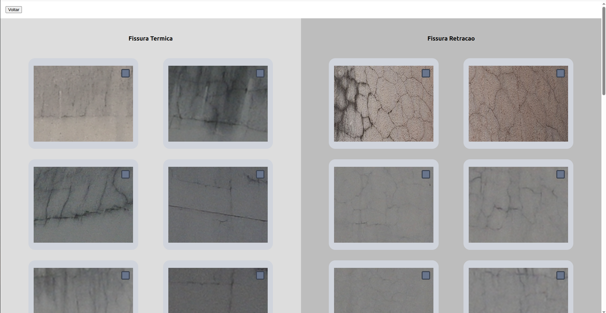

# Frontend


## Escopo da Sprint

Nesta nova etapa, evoluímos a interface do sistema adicionando funcionalidades que aproximam o produto de seu uso real em campo. A Sprint concentrou-se em ampliar a cobertura de fluxos de navegação, melhorar a experiência do usuário durante a criação de projetos e preparar o frontend para a integração direta com o modelo de IA.

As entregas contemplam:

* Adição das telas de **Projetos**, **Prédios** e **Fachadas**;
* **Refatoração do popup de criação de projeto**, que deixou de exigir upload de imagens imediatamente;
* Inclusão da nova **tela de Resultado**, com visualização de imagens analisadas;
* Implementação de um **modal de confirmação de envio** para o modelo, substituindo o uso de `confirm()`.

---

## Fluxo Lógico das Telas 

```
// Tela de Projetos
Ao acessar a tela inicial:
  → Listar todos os projetos cadastrados
  → Permitir navegação para prédios associados

// Tela de Prédios
Ao clicar em um projeto:
  → Listar todos os prédios associados
  → Permitir navegação para fachadas específicas

// Tela de Fachadas
Ao clicar em um prédio:
  → Exibir cards com as imagens da fachada
  → Permitir análise individual e envio ao modelo

// Envio ao modelo
Ao clicar em "Enviar ao modelo":
  → Exibir modal de confirmação
  → (futuro) Disparar requisição ao backend
  → Atualizar status da imagem
```

---

## Decisões Técnicas e Arquiteturais

* **Separação de rotas por contexto**: A navegação foi organizada por tipo de entidade (projetos → prédios → fachadas), respeitando a hierarquia do sistema.
* **Modal customizado**: O popup de envio ao modelo foi redesenhado com componentes próprios em React + Tailwind, oferecendo melhor controle visual e estilização.
* **Flexibilidade no cadastro**: A criação de projetos não exige mais imagens no ato, favorecendo a separação entre estrutura e dados brutos.
* **Preparação para integração backend**: Todos os pontos críticos de interação foram isolados em funções assíncronas, facilitando a troca de dados futura com a API.

---

## Funcionalidades Entregues

* Tela de **listagem e navegação entre projetos**;
* Tela de **prédios organizados por projeto**;
* Tela de **fachadas com visualização por imagem**;
* Modal de **criação de projeto** simplificado;
* Tela de **resultados com visualização das classificações realizadas**;
* **Modal de envio** ao modelo com seleção da pasta a ser enviada.

---
## Telas desenvolvidas

- Tela de projetos
  
_Fonte: Os autores (2025)_

- Tela de prédios
 
_Fonte: Os autores (2025)_

- Tela de fachadas
 
_Fonte: Os autores (2025)_

- Tela de visualização de fachada
 
_Fonte: Os autores (2025)_

- Tela de envio para o modelo
 
_Fonte: Os autores (2025)_

- Tela de resultado do modelo
 
_Fonte: Os autores (2025)_

---

## Demonstração em Vídeo: Fluxo completo do sistema
<div align='center'>
<iframe width="560" height="315" src="https://www.youtube.com/embed/d5njflrjH0E?si=yb5nDj7X8BC1UOSi" title="YouTube video player" frameborder="0" allow="accelerometer; autoplay; clipboard-write; encrypted-media; gyroscope; picture-in-picture; web-share" referrerpolicy="strict-origin-when-cross-origin" allowfullscreen></iframe>
</div>
---

## Dificuldades Enfrentadas

Nessa Sprint, os principais desafios do front giraram em torno da ausência de rotas post ou similares, visto que sem elas a interface ainda não permite a criação de novos projetos, prédios ou fachadas, além de não ser possível subir novas imagens para o banco de dados. Para contornar essa limitação e viabilizar testes visuais, utilizamos o componente <code>ImgSection</code> para simular a exibição de imagens a partir de arquivos estáticos.. Como essas imagens não podem ser publicadas por fazerem parte dos arquivos do IPT, elas não subiram diretamente para o repositório, mas foram colocadas em <code>public/images</code> dentro do diretório <code>frontend</code>. Essa pasta contém 40 imagens, sendo 20 térmicas e 20 de retração nomeadas com o padrão FT1.PNG e FR1.PNG respectivamente e de 1 a 20 para cada uma delas. 

No mais, outro desafio do frontend nessa sprint foi o compartilamento de informações (como o nome do projeto acessado) entre várias páginas e componentes diferentes, o que foi resolvido com a criação de um contexto, que armazena essa informação (e qualquer outra informação desejada) e permite o uso dela em qualquer outro arquivo por meio de sua importação.


---

## Considerações Finais

A evolução da interface nesta sprint representa um avanço significativo na experiência do usuário, consolidando a arquitetura por entidade (projeto, prédio, fachada) e permitindo uma jornada visual e funcional clara. Ao implementar o envio de dados para o modelo e dar mais flexibilidade ao cadastro de dados, a aplicação se aproxima cada vez mais de um sistema robusto e amigável para técnicos e engenheiros de campo.
