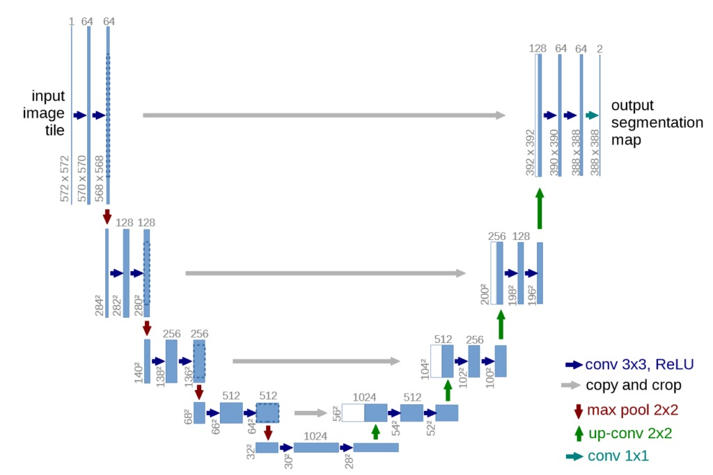

---

title: Pesquisa sobre o Modelo U-Net
sidebar\_position: 1
--------------------

## Documentação da Pesquisa de Modelos – U-Net

Durante a Sprint 3, uma das principais tarefas definidas pelo time foi a realização de uma pesquisa aprofundada sobre o modelo **U-Net**, com o objetivo de avaliar sua viabilidade e aplicação dentro do escopo do nosso projeto. A intenção era entender como esse modelo poderia complementar ou substituir parcialmente a abordagem que já vínhamos desenvolvendo com o modelo **YOLO**, ampliando a performance e precisão da classificação e segmentação de imagens.

---

### **O que é o modelo U-Net?**

O U-Net é uma arquitetura de rede neural convolucional especialmente projetada para tarefas de segmentação de imagens. Aparentemente originalmente, foi proposta para aplicações médicas, como a segmentação de órgãos em exames clínicos, sua estrutura se mostrou extremamente eficaz em diversas áreas que envolvem a separação precisa de objetos dentro de uma imagem.

A arquitetura se chama “U-Net” por conta do seu formato em "U", composto por duas partes principais:

_Fonte: Os autores (2025)_

* **Caminho de contração (encoder)**: responsável por capturar o contexto da imagem, reduzindo progressivamente a resolução, mas aumentando a profundidade e extraindo as principais características.

* **Caminho de expansão (decoder)**: responsável por reconstruir a segmentação da imagem original com base nas características extraídas, utilizando operações de upsampling (como convoluções transpostas) e conexões diretas com camadas anteriores (skip connections), o que permite recuperar detalhes espaciais finos.

Essa estrutura o torna extremamente eficiente para **detectar e segmentar com precisão áreas específicas** em imagens, mesmo com conjuntos de dados relativamente pequenos — o que poderia ser uma grande vantagem no nosso caso.

---

### **Possíveis usos do U-Net no projeto**

Ao longo da pesquisa foram analizados vídeos, artigos e exemplos práticos de uso do U-Net. A partir disso, destacamos alguns possíveis cenários em que o modelo poderia se encaixaria bem no nosso projeto:

* **Segmentação de regiões específicas nas imagens**, onde o objetivo não é apenas classificar a imagem como um todo, mas identificar precisamente quais regiões pertencem a determinada classe (ex: separar partes relevantes da imagem para análise posterior).

* **Complemento ao YOLO**, em situações onde a detecção feita por bounding boxes do YOLO seja insuficiente ou imprecisa, o U-Net poderia atuar refinando os contornos reais dos objetos.

* **Refinamento visual**, para aplicações em que a precisão do recorte de um objeto seja essencial, melhorando a experiência visual e os resultados gerados pelo sistema.

---

### **Por que não implementamos o U-Net**

Apesar do grande potencial e da eficácia comprovada do modelo, alguns fatores nos levaram a decidir **não iniciar a implementação do U-Net na Sprint 3**:

* **Complexidade técnica:** O modelo exige um nível de estrutura mais robusto, tanto em termos de arquitetura quanto de pré-processamento e pós-processamento dos dados.

* **Curva de aprendizado:** Por não ser um modelo que já estávamos utilizando, sua adoção exigiria um tempo significativo de estudo, testes e adaptações — o que poderia comprometer o andamento das outras entregas.

* **Escopo e prazo do projeto:** Estamos atualmente na quarta de cinco sprints. Iniciar uma nova arquitetura neste ponto do cronograma comprometeria o foco na finalização das funcionalidades principais e testes com os modelos já em uso.

Dessa forma, a equipe optou por **manter o foco no refinamento do modelo YOLO**, que já está em desenvolvimento e apresenta resultados promissores, deixando o U-Net como **uma possibilidade futura** que pode ser adotada pelo IPT, caso o projeto venha a se estender ou evoluir em versões seguintes.

---

## Considerações finais

A pesquisa sobre o modelo U-Net foi essencial para a tomada de decisão da sprint. Mesmo sem sua implementação direta neste momento, o conhecimento adquirido enriquece a base técnica do projeto e abre portas para evoluções futuras mais robustas, principalmente em cenários onde segmentação precisa for uma demanda crítica.

A escolha de **não implementar o modelo** não foi por falta de mérito da arquitetura, mas sim uma decisão estratégica diante das restrições reais do projeto: prazo, escopo e foco nas entregas prioritárias. Seguimos com a implementação e otimização do YOLO, mas com a consciência clara de que, tecnicamente, o U-Net permanece como uma alternativa viável e potente para casos de uso mais específicos.
