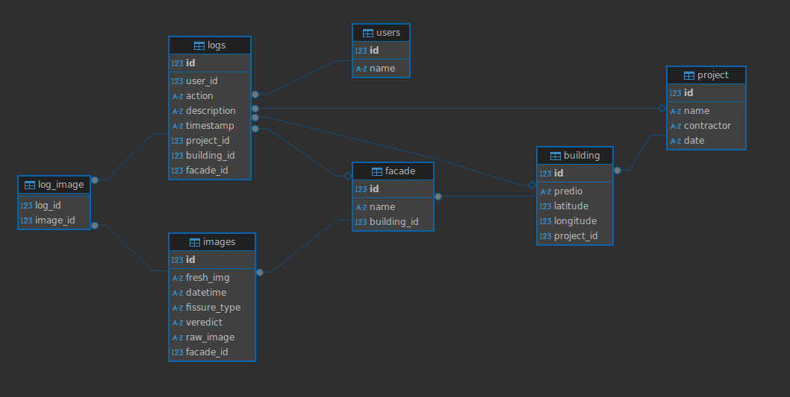

# Documentação do Banco de Dados

Essa seção descreve a modelagem e estrutura do banco de dados utilizado para o gerenciamento dos projetos, imagens, usuários e logs da aplicação. O banco de dados foi implementado utilizando PostgreSQL e está hospedado no Render. A seguir, são apresentados detalhes sobre a modelagem relacional, as tabelas, atributos e suas conexões.

---

## 2. Modelagem Relacional

Abaixo, é possível visualizar a modelagem relacional do banco de dados:

---

## 3. Estrutura das Tabelas

### 3.1 Tabela: **users**

| Atributo | Tipo    | Descrição                      |
| -------- | ------- | ------------------------------ |
| `id`     | Integer | Identificador único do usuário |
| `name`   | String  | Nome do usuário                |

Representa os usuários da aplicação, responsáveis por ações como análise, classificação ou modificação das imagens.

---

### 3.2 Tabela: **project**

| Atributo     | Tipo    | Descrição                      |
| ------------ | ------- | ------------------------------ |
| `id`         | Integer | Identificador único do projeto |
| `name`       | String  | Nome do projeto                |
| `contractor` | String  | Nome do contratante            |
| `date`       | String  | Data de criação do projeto     |

Cada projeto pode estar vinculado a vários prédios (relação 1\:N).

---

### 3.3 Tabela: **building**

| Atributo     | Tipo    | Descrição                                    |
| ------------ | ------- | -------------------------------------------- |
| `id`         | Integer | Identificador único do prédio                |
| `predio`     | String  | Nome ou identificador do prédio              |
| `latitude`   | Integer | Latitude do prédio                           |
| `longitude`  | Integer | Longitude do prédio                          |
| `project_id` | Integer | Chave estrangeira para o projeto relacionado |

Cada prédio pode conter várias fachadas (relação 1\:N).

---

### 3.4 Tabela: **facade**

| Atributo      | Tipo    | Descrição                                   |
| ------------- | ------- | ------------------------------------------- |
| `id`          | Integer | Identificador único da fachada              |
| `name`        | String  | Nome da fachada (Ex: Norte, Leste, etc.)    |
| `building_id` | Integer | Chave estrangeira para o prédio relacionado |

Cada fachada está associada a um único prédio e pode conter várias imagens (relação 1\:N).

---

### 3.5 Tabela: **images**

| Atributo       | Tipo    | Descrição                                    |
| -------------- | ------- | -------------------------------------------- |
| `id`           | Integer | Identificador único da imagem                |
| `raw_image`    | String  | URL da imagem original armazenada            |
| `fresh_img`    | String  | URL da imagem processada                     |
| `datetime`     | String  | Data e hora de captura da imagem             |
| `fissure_type` | String  | Tipo de fissura identificado                 |
| `veredict`     | String  | Veredito do tipo de fissura dado pelo pesquisador |
| `facade_id`    | Integer | Chave estrangeira para a fachada relacionada |

As imagens estão associadas diretamente a uma fachada, permitindo melhor organização por lateral dos prédios.

---

### 3.6 Tabela: **logs**

| Atributo      | Tipo    | Descrição                                               |
| ------------- | ------- | ------------------------------------------------------- |
| `id`          | Integer | Identificador único do log                              |
| `user_id`     | Integer | Chave estrangeira para o usuário relacionado            |
| `action`      | String  | Ação executada no sistema (ex: upload, análise, etc.)   |
| `description` | String  | Descrição complementar sobre a ação                     |
| `timestamp`   | String  | Data e hora do evento registrado                        |
| `project_id`  | Integer | Chave estrangeira para o projeto relacionado (opcional) |
| `building_id` | Integer | Chave estrangeira para o prédio relacionado (opcional)  |
| `facade_id`   | Integer | Chave estrangeira para a fachada relacionada (opcional) |

A tabela de logs agora permite associar diretamente ações a múltiplas entidades (usuário, projeto, prédio e fachada), aumentando a rastreabilidade.

---

### 3.7 Tabela: **log\_image**

| Atributo   | Tipo    | Descrição                                   |
| ---------- | ------- | ------------------------------------------- |
| `log_id`   | Integer | Chave estrangeira para o log                |
| `image_id` | Integer | Chave estrangeira para a imagem relacionada |

Relacionamento N\:N entre logs e imagens, permitindo que um mesmo log esteja vinculado a múltiplas imagens e vice-versa.

---

## 4. Relacionamentos

* **User** possui um relacionamento **1\:N** com **Logs**.
* **Project** possui um relacionamento **1\:N** com **Building**.
* **Building** possui um relacionamento **1\:N** com **Facade**.
* **Facade** possui um relacionamento **1\:N** com **Images**.
* **Image** possui um relacionamento **N\:N** com **Logs** através da tabela intermediária **log\_image**.
