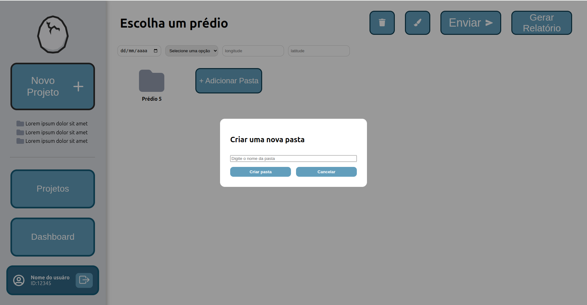
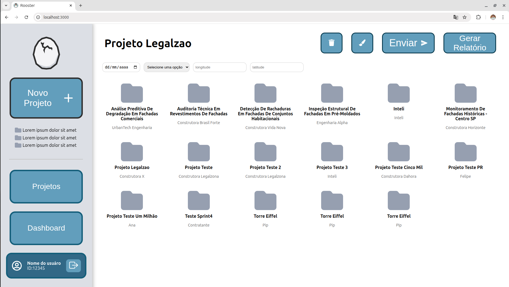
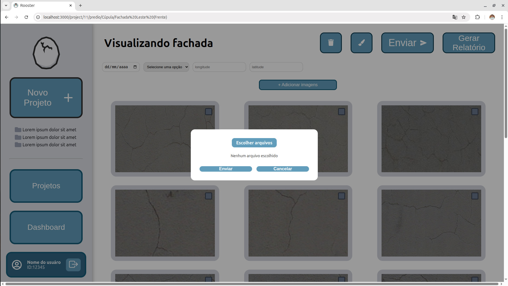

# Frontend

## Escopo da Sprint

Nesta sprint, focamos em integrar as rotas de adição (permitindo a criação de novos projetos, prédio e fachadas, e também o upload de imagens por fachada), assim como criar a funcionalidade de gerar relatório e integrar a tela de resultados.
As entregas contemplam:

---

## Funcionalidades Entregues

* Popup de adição de novas pastas;
* Remoção do botão de adicionar projetos da tela de projeto (mantendo-o só na navbar para melhor usabilidade);
* Botão para gerar relatórios;
* Integração do botão "Adicionar Pasta" com o backend.

---
## Funcionalidades desenvolvidas desenvolvidas

- Popup de adição de pastas
  
_Fonte: Os autores (2025)_

- Versão final da tela de projetos, sem o botão de add projeto em seu corpo e com o botão de gerar relatório no topo direito da tela
 
_Fonte: Os autores (2025)_

- Tela de adição de imagens
 
_Fonte: Os autores (2025)_

---

## Demonstração em Vídeo: Fluxo completo do sistema

<iframe width="560" height="315" src="https://www.youtube.com/embed/HPIe_3TKhwY?si=H_JfqRsZ1vsXqGhv" title="YouTube video player" frameborder="0" allow="accelerometer; autoplay; clipboard-write; encrypted-media; gyroscope; picture-in-picture; web-share" referrerpolicy="strict-origin-when-cross-origin" allowfullscreen></iframe>

---

## Dificuldades Enfrentadas

Nessa Sprint, os principais desafios do frontend envolveram a integração das rotas de adição, especialmente devido a incompatibilidades entre o JSON enviado pelo frontend e o formato esperado pelo backend. Ajustes específicos foram necessários, principalmente na rota de envio de imagens. Outro desafio relevante foi a integração da tela de resultados, já que o backend inicialmente retornava um array vazio — causado por erros no caminho do modelo. Após adaptações em ambas as partes da aplicação, o sistema agora é capaz de executar todas as funcionalidades principais de forma integrada, da criação de projetos até a exibição dos resultados individualizados por fachada.

## Feedbacks do teste com o parceiro

Após o teste de usabilidade realizado com o parceiro de projeto, obtivemos alguns insights de melhorias na interface para que fique ainda mais intuitiva, sendo eles:

- Nas telas de projeto e prédio, renomear o botão "Adicionar Pasta" por "Adicionar Prédio" e "Adicionar Fachada", respectivamente;
- Implementar opção de envio das pastas com botão "Enter" do teclado;
- Renomear botão de envio para o modelo de "enviar" para "Classificar";
- Adicionar telas de feedback de carregamento, para que quando as imagens estiverem sendo uplodadas ou enviadas pro modelo, o usuário possa ter um feedback de progresso dessas tarefas.

---

## Considerações Finais

A evolução da interface nesta sprint representa um avanço significativo em sua usabilidade, visto que agora toda a funcionalidade principal da plataforma já está implementada e conectada ao backend e ao banco de dados, permitindo ao usuário uso completo do sistema. Na Sprint final, o foco será aprimorar a experiência do usuário e garantir a responsividade da interface, tornando o sistema plenamente funcional e pronto para uso.
