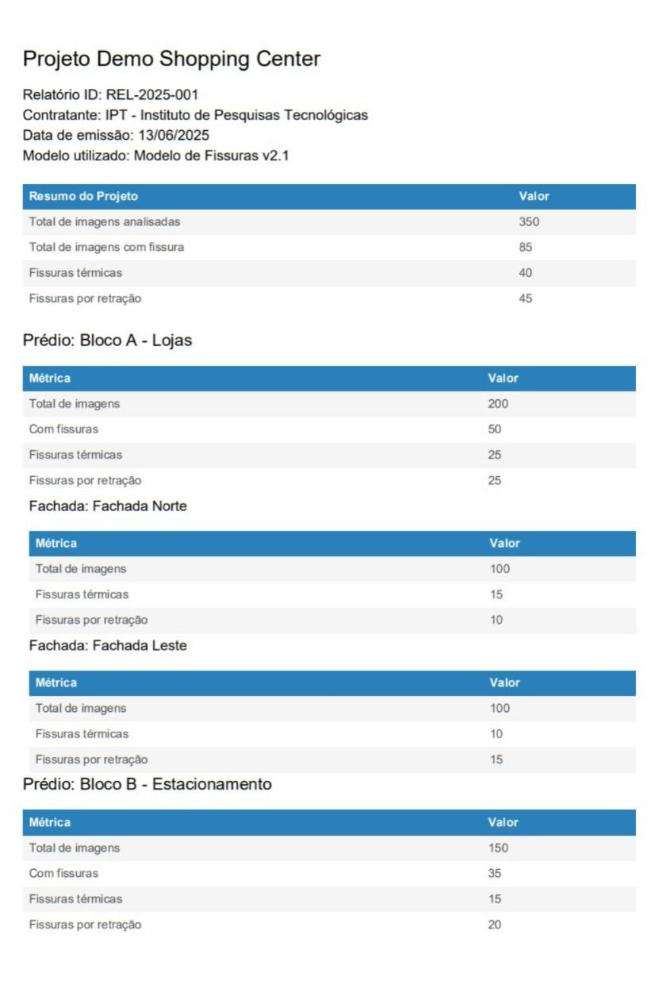

## Geração de Relatórios

Essa funcionalidade foi desenvolvida com o objetivo de permitir a geração automática de relatórios PDF diretamente pela interface do usuário, com base nos dados armazenados no banco de dados e em conformidade com os modelos previamente aprovados pelos parceiros do projeto.

---

### Visão Geral da Funcionalidade

A nova funcionalidade foi incorporada à barra de navegação da aplicação, por meio do botão **"Gerar Relatório"**. Quando clicado, esse botão abre um **pop-up modal**, permitindo que o usuário selecione um projeto para o qual deseja gerar o relatório. Após a seleção, o usuário clica novamente em um botão de confirmação que dispara a geração do relatório, com base em dados recebidos de uma rota `GET` do backend.

Esse processo envolve três etapas principais:

1. **Seleção do Projeto**
2. **Geração do Relatório com os Dados em JSON**
3. **Download automático do PDF**

---

### Integração com o Banco de Dados

Para preencher a lista de projetos no `dropdown`, a aplicação realiza uma chamada à rota:

```http
GET http://localhost:5000/projects
```

Essa rota retorna um array com os projetos disponíveis no banco. A seleção do projeto é então armazenada em um state local (selectedReportProject), usado para gerar o relatório.

### Estrutura do JSON Recebido

O backend retorna um JSON com estrutura semelhante a esta:

```
{
  "informacoes_gerais": {
    "id_relatorio": "REP-2025-06-001",
    "nome_projeto": "Edifício Copan - Restauração 2025",
    "nome_contratante": "Administradora XYZ",
    "data_emissao_relatorio": "2025-06-10T17:03:00Z",
    "modelo_utilizado": "YOLOv8-cls-v1.2"
  },
  "resumo_quantitativo_projeto": {
    "total_imagens_analisadas": 2500,
    "total_imagens_com_fissura": 235,
    "total_fissuras_por_tipo": {
      "fissura_termica": 150,
      "fissura_retracao": 85
    }
  },
  "detalhamento_por_predio": [
    {
      "id_predio": 1,
      "nome_predio": "Bloco A",
      "resumo_quantitativo_predio": {
        "total_imagens": 1200,
        "total_imagens_com_fissura": 125,
        "fissura_termica": 80,
        "fissura_retracao": 45
      },
      "fachadas": [
        {
          "id_fachada": 101,
          "nome_fachada": "Fachada Norte",
          "resumo_quantitativo_fachada": {
            "total_imagens": 300,
            "fissura_termica": 30,
            "fissura_retracao": 15
          }
        },
        {
          "id_fachada": 102,
          "nome_fachada": "Fachada Sul",
          "resumo_quantitativo_fachada": {
            "total_imagens": 300,
            "fissura_termica": 50,
            "fissura_retracao": 30
          }
        }
      ]
    },
    {
      "id_predio": 2,
      "nome_predio": "Bloco B",
      "resumo_quantitativo_predio": {
        "total_imagens": 1300,
        "total_imagens_com_fissura": 110,
        "fissura_termica": 70,
        "fissura_retracao": 40
      },
      "fachadas": [
        // ... lista de fachadas do Bloco B
      ]
    }
  ]
}
```

Esse JSON é utilizado para alimentar uma função chamada generatePDF(), que utiliza as bibliotecas jsPDF e jspdf-autotable para gerar o arquivo em PDF.

### Geração do PDF

A função generatePDF(data) realiza as seguintes ações:

1. Exibe no topo do PDF as informações gerais do projeto (nome, ID, contratante, data e modelo);

2. Cria uma tabela resumo do projeto com total de imagens, fissuras por tipo, etc;

3. Para cada prédio listado no JSON, gera:

* Uma seção com nome e tabela de resumo;

* Subseções para cada fachada, com respectivas tabelas.

(Exemplo resumido)

```
const generatePDF = (data) => {
  const doc = new jsPDF();

  doc.setFontSize(18);
  doc.text(data.informacoes_gerais.nome_projeto, 14, 20);

  autoTable(doc, {
    startY: 55,
    head: [['Resumo do Projeto', 'Valor']],
    body: [
      ['Total de imagens analisadas', data.resumo_quantitativo_projeto.total_imagens_analisadas],
      ['Total de imagens com fissura', data.resumo_quantitativo_projeto.total_imagens_com_fissura],
      ...
    ]
  });

  // Itera sobre prédios e fachadas com base no JSON
  data.detalhamento_por_predio.forEach(predio => {
    ...
    predio.fachadas.forEach(fachada => {
      ...
    });
  });

  doc.save(`${data.informacoes_gerais.nome_projeto}.pdf`);
};
```
---

### Benefícios para o Parceiro

Essa funcionalidade foi pensada para integrar-se aos relatórios que o parceiro já preenche manualmente. Ao disponibilizar os dados em formato estruturado (JSON) e em formato final (PDF), ganhamos:

* Agilidade na documentação técnica;

* Padronização nos relatórios;

* Possibilidade futura de modificação do modelo do relatório, para automatizar os relatórios do parceiro no geral.

O parceiro destacou o valor do JSON como insumo de dados, portanto essa etapa do processo será mantida na estrutura futura da aplicação.

---

### Fluxo do Usuário

1. Usuário acessa a barra superior e clica em "Gerar Relatório";

2. Um pop-up é exibido com uma lista de projetos disponíveis;

3. Usuário seleciona o projeto desejado;

4. Ao confirmar, o sistema:

* Chama a função generatePDF com os dados mockados (ou reais no futuro);

* Exibe o prompt de download do arquivo PDF:

  
_Fonte: Os autores (2025)_

---

### Considerações Finais

A implementação da geração de relatórios representa um passo importante na consolidação da plataforma, garantindo maior profissionalismo, clareza na entrega de resultados e praticidade para o time técnico e parceiros. O uso de dados mockados na versão de demonstração será posteriormente substituído por chamadas reais ao backend, tendo em vista que o código já estava pronto para receber as informações oficiais, mas como dependemos da finalização do salvamente de dados pós veredito, algo que não foi possível realizar nessa sprint, será facilmente modificado na próxima.